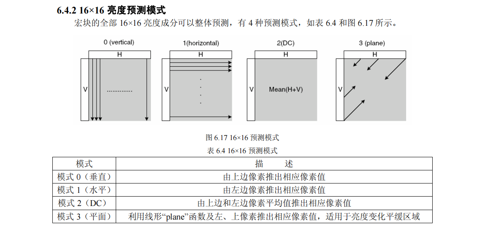
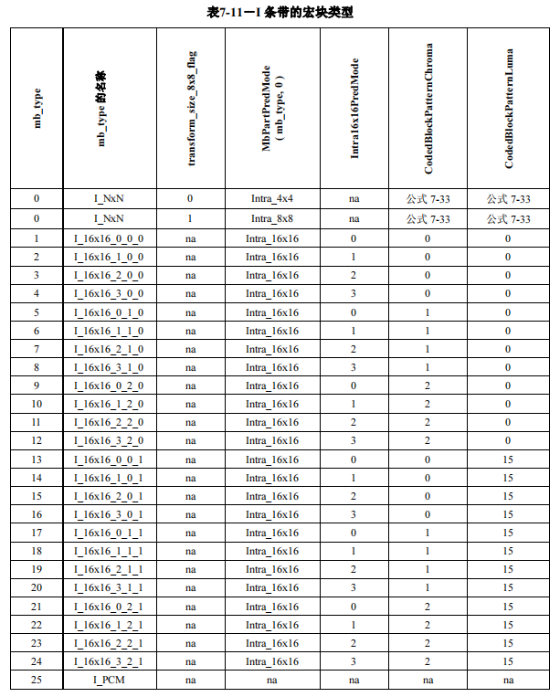
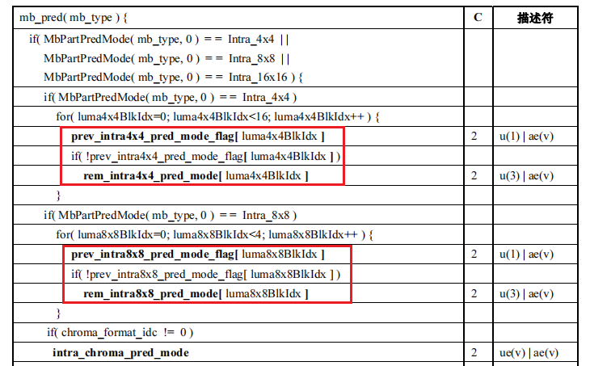

## 宏块分析函数

*这里引用雷神的“宏块分析（Analysis）部分的函数调用关系图”*


**由于作者使用的x264版本与雷神的不一致，所以函数名可能也有部分差异，例如部分函数在更新版本的x264中没有前面的“x264_”，但不影响上面那幅图的阅读**


## 宏块类型

我们知道，H.264是以16x16宏块为单位进行编码的，但16x16的宏块可以进行划分，形成多种尺寸，包括16x8、8x16、8x8、8x4、4x8、4x4等。

宏块包含多种类型，可以分为三大类型：

- **I宏块：I_16x16、I_8x8、I_4x4、I_PCM**
- P宏块：P_16x16、P_16x8、P_8x16、P_8x8、P_8x4、P_4x8、P_4x4、P_SKIP
- B宏块：B_16x16、B_16x8、B_8x16、B_8x8、B_8x4、B_4x8、B_4x4、B_SKIP、B_Direct

**其中IDR/I帧只允许包含I宏块、P帧允许包含P宏块也允许包含I宏块， B帧允许包含B宏块和I宏块**

一般而言，画面比较平坦的区域使用尺寸比较大的宏块进行编码，画面比较复杂的区域使用尺寸比较小的宏块进行编码


## 宏块类型分析

由于不同的宏块可以划分为多种不同的尺寸，宏块类型分析的目的就是**决定当前宏块以何种宏块类型进行编码**，对于Intra宏块可以是I16x16、I8x8、或者I4x4.

宏块类型分析的大概流程遍历所有可能的宏块类型，选择最优的一个作为当前宏块的编码类型

**那么如何判断当前宏块是否是最优的呢？**(关于率失真详细可参考[10.率失真优化RDO.md](./10.率失真优化RDO.md])章节)

最优可以理解为编码代价“最小”。**x264的编码代价依据率失真理论计算得到**，即**Cost = D + lambda*R**，**其中D表示失真度，R表示码流大小**。 x264提供三种方式用于计算Cost值：

-  前两种类型lambda和R是一样的，其中**D分别通过SAD和SATD表示**，**R用于表示一些macroblock_layer的一些字段的bits开销**(不会包含residual的bits，因为sad、satd的计算不会真正对当前宏块进行encode，所以是得不到residual编码后的bits的)；对于Intra宏块而言R用于表示”帧内预测模式的比特开销“，对于Inter宏块R用于表示”运动矢量残差，参考帧索引的比特开销“
- 第三种就是RDO(率失真优化)，也是通过**Cost = D + lambda*R**的公式计算得到编码代价，不过与前两种不同的是，此方式的D是通过解码后宏块与原始宏块的SSD值表示，R表示当前宏块编码后的bits开销，lambda使用的值也与sad/satd的不一样。 由于此方式在宏块分析阶段(x264_macroblock_analyse)就涉及到真正的”x264_macroblock_encode“操作，因此计算复杂度也是最高的

> SAD就是将两个宏块按照位置进行像素相减，再将绝对值累加起来，这种方式仅反映残差时域差异，影响PSNR的值，不能有效反映码流的大小。
>
> SATD即将像素残差再经过**hadamard变换**后累加的绝对值，可以将其看作简单的时频变换，其值在一定程度上可以反映生成码流的大小。
>
> SATD对比SAD多了一步哈达玛变换，因此引入了额外的计算量，但由于能够反映频域的信息情况，因此能够决策出“更优”的方式
>
> 编码后的码流的大小是和图像块DCT变换后频域信息紧密相关的，而和变换前的时域信息关联性小一些；SAD只能反应时域信息，SATD却可以反映频域信息，而且Hadamard变换计算复杂度也低于DCT变换，因此是比较合适的模式选择的依据

具体使用SAD还是SATD，由编码参数i_subpel_refine决定，i_subpel_refine > 1使用SATD，否则使用SAD。


## 帧内编码基础知识介绍

帧内编码是利用图像空间上的高度相关性，编码当前宏块时可以通过周围已经编码重建后的像素推导出一个“虚假宏块”，然后只需传递给解码器当前宏块与“虚假宏块”的残差值即可。

对于16x16的亮度块有4种帧内预测模式，8x8和4x4的亮度块都有9种帧内预测模式；而色度块也拥有4种帧内预测模式，预测方向与16x16亮度的一样只是序号不太一样。


**毕老师那本H264书籍中是没有I_8x8的，I_8x8的帧内预测模式与I_4x4的一样**





### H264帧内预测模式解析

这里先抛出一个问题：**解码器如何知道当前Intra宏块的宏块类型以及帧内预测模式的？**

*(P帧的宏块类型的解析会在帧间编码章节介绍，这里就不重复介绍了)*

#### 宏块类型的解析

*我们先看一下h264宏块层的语法，主要关注红色框部分*


**每个宏块的都有一个mb_type用于标识当前宏块的类型**，下面是I Slice宏块对应Intra宏块的标号




上面已经介绍了，Intra宏块有I_16x16、I_8x8、I_4x4、I_PCM四种类型，但是这里竟然多达27种，中间多了很多I_16x16_x_x_x的类型，这是这么回事呢？

我个人认为是H264为了进一步压缩码率，单独将I_16x16分了多种类型。我们知道Intra_16x16的亮度帧内预测模式最高支持4种(DC、H、V、Plane四个方向的)，序号为0 ~ 3 ，一般而言我们是需要将当前宏块的帧内预测模式写进宏块层码流之中的（这需要占用到一定的比特数的)，但H264中为了节省这点比特将当前预测模式以及CBP统一放到mb_type当中了。

以上图的mb_type = 1,2,3,4的类型为例(暂时忽略CBP)，如果当前宏块是Intra_16x16的，且帧内预测模式的序号是1，则对应的mb_type就为2，这里不需要再将帧内预测模式写进码流中，解码器可以根据mb_type的值查表解析出当前宏块类型和帧内预测模式

> CBP，CodedBlockPattern的缩写。在h264中，将一个16x16块划分四个8x8的区域，如果某个8x8的区域变换量化后的值都为0的话，是可以不去传递全为“0”的残差值，但需要有一个标识，去表示某个8x8块的残差是否需要传递，解码端在解码时检测到此标识说明当前8x8块的残差为0，直接填充0即可。
>
> 这个标识就是CBP，CBP一共占6bits(YUV420的情况下)，分为两个部分，一个是亮度CBP占4bits(CBP的低4位)，一个是色度CBP占2bits(高2位)
>
> 如果某个16x16宏块的CBP是000100，解析得到cbp_chroma = 00，cbp_luma = 0100，说明码流中不存在当前色度块的残差，且不存在亮度块0，2，3的残差，但存在亮度块1的残差

 

#### 亮度帧内预测模式的解析

对于Intra16x16宏块预测模式的解析前面已经介绍了，直接根据mb_type查表即可，这里介绍Intra_8x8、Intra_4x4的

我们知道亮度Intra_8x8、Intra_4x4包含9种帧内预测模式，序号0~8，正常来说需要4bit才能表示9种模式2^4 = 16 > 9，如果当前是Intra_4x4的话，一个16x16宏块包含16个4x4宏块，每个4x4宏块都用4bit去存储当前预测模式的话，那将消耗16 * 4 = 64bit，这数据量无疑是比较大的，因此h264*另辟*蹊径。

*先看一张关乎预测模式的图片*




不管是Intra_4x4还是Intra_8x8，都会拥有**prev_intraXxX_pred_mode_flag**和**rem_intraXxX_pred_mode**， 4x4会有16个，8x8会有4个

对于Intra_4x4和Intra_8x8的宏块都有一个**预测帧内预测模式**，就是根据上方宏块的预测模式，和左方宏块的预测模式推导出一个值，此值就是预测帧内预测模式，下面是x264中获取预测帧内预测模式的代码

```c++
// x264源码 common/macroblock.h和common/predict.h
static const int8_t x264_mb_pred_mode4x4_fix[13] =
{
    -1,
    I_PRED_4x4_V,   I_PRED_4x4_H,   I_PRED_4x4_DC,
    I_PRED_4x4_DDL, I_PRED_4x4_DDR, I_PRED_4x4_VR,
    I_PRED_4x4_HD,  I_PRED_4x4_VL,  I_PRED_4x4_HU,
    I_PRED_4x4_DC,  I_PRED_4x4_DC,  I_PRED_4x4_DC
};
#define x264_mb_pred_mode4x4_fix(t) x264_mb_pred_mode4x4_fix[(t)+1]

// 获取Intra4x4块的预测帧内预测模式
static ALWAYS_INLINE int x264_mb_predict_intra4x4_mode( x264_t *h, int idx )
{
    // 左方宏块的帧内预测模式
    const int ma = h->mb.cache.intra4x4_pred_mode[x264_scan8[idx] - 1];
    // 上方宏块的帧内预测模式
    const int mb = h->mb.cache.intra4x4_pred_mode[x264_scan8[idx] - 8];
    // 根据左方、上方的预测模式获取预测帧内预测模式(两者取最小的一个)
    const int m  = X264_MIN( x264_mb_pred_mode4x4_fix(ma),
                             x264_mb_pred_mode4x4_fix(mb) );

    if( m < 0 ) // 如果左方宏块或者上方宏块是无效宏块，得到的m会小于0，此时直接将I_PRED_4x4_DC作为当前宏块的预测帧内预测模式
        return I_PRED_4x4_DC;
    
    return m;
}
```

prev_intraXxX_pred_mode_flag为true时，表示**不需要**额外传递当前宏块的帧内预测模式(即预测帧内预测模式等于实际的帧内预测模式)

prev_intraXxX_pred_mode_flag为false时，表示**需要**额外传递当前宏块的帧内预测模式，具体的值写在rem_intraXxX_pred_mode里面

**假设当前4x4宏块的实际帧内预测模式是x，预测帧内预测模式是y**

- 如果x == y时，即真正的帧内预测模式等于预测帧内预测模式，此时将prev_intra4x4_pred_mode_flag[i]设为1即可，不再需要传递rem_intra4x4_pred_mod的值； 解码端在解析时发现prev_intra4x4_pred_mode_flag[i]为1，可以直接根据上方、左方宏块的预测模式推导出当前宏块的帧内预测模式
- 如果x != y时，需要真正传递帧内预测模式，将prev_intra4x4_pred_mode_flag[i]置为0。如果x < y时，rem_intra4x4_pred_mode[i] = x，如果 x > y时rem_intra4x4_pred_mode[i] = x - 1

仔细看x != y 的情况，这种设计比较巧妙：

```c++
// 编码伪代码
if( x < y)
    rem_intraXxX_pred_mode[i] = x;
else
    rem_intraXxX_pred_mode[i] = x - 1;
```

我们知道Intra_4x4帧内预测模式的序号是0~8的，所以x，y的范围也是0~8。对于x < y的情况下，x的最大值是7，此时可以用3bit去表示当前的预测模式了；如果x > y的话，x的范围是[y+1，8]，那么rem_intra4x4_pred_mode的值可以设置为x-1，rem_intra4x4_pred_mode的范围就是[y， 7]， 此时也可以用3bit去表示了；

**在解码时**，我们需要获取当前4x4的真实帧内预测模式x(未知数)，首先根据上方、左方宏块的预测模式得到预测帧内预测模式y，然后获取prev_intra4x4_pred_mode_flag、rem_intra4x4_pred_mode的值。如果prev_intra4x4_pred_mode_flag为1，那么x = y(解析完成)； 如果prev_intra4x4_pred_mode_flag为0，如果rem_intra4x4_pred_mode < y，那么x = rem_intra4x4_pred_mode， 否则 x = rem_intra4x4_pred_mode + 1

```c++
// 解码伪代码
int x; // 待获取的当前4x4宏块的帧内预测模式(是个未知数)
int y = X264_MIN(ma,mb); // 获取预测帧内预测模式
int prev_intra4x4_pred_mode_flag = read(); // 从码流中获取prev_intra4x4_pred_mode_flag的值
if(prev_intra4x4_pred_mode_flag == 1) {
    x = y;
} else {
	int rem_intra4x4_pred_mode = read();  // 从码流中获取rem_intra4x4_pred_mode的值
    if(rem_intra4x4_pred_mode < y)
        x = rem_intra4x4_pred_mode;
    else
        x = rem_intra4x4_pred_mode + 1;
}
```


当实际预测模式等于预测帧内预测模式时，只需要1bit就能表示出来(prev_intra4x4_pred_mode_flag)，不相等时需要4bit来表示(prev_intra4x4_pred_mode_flag的1bit + rem_intra4x4_pred_mode的3bit)。 如果没有这种“方法”，不管实际预测模式是否等于预测帧内预测模式都需要4bit来表示 ，这样对比下来确实能省下不少比特占用


#### 色度帧内预测模式

由于色度帧内预测模式只有4种，序号0~3，直接写进码流种，见宏块预测语法中的*intra_chroma_pred_mode*, 下图是色度预测模式对应的序号


## 源码分析

在每编码一块宏块前都会调用x264_macroblock_analyse函数，对当前宏块进行分析，决定当前宏块以何种类型进行编码以及帧内预测模式等。

此函数在slice_write中被调用

```c++
/* 宏块分析，函数位置encoder/encoder.c*/
void x264_macroblock_analyse( x264_t *h )
{
    x264_mb_analysis_t analysis;
    int i_cost = COST_MAX;
	// 获取当前宏块的QP
    h->mb.i_qp = x264_ratecontrol_mb_qp( h );
    /* If the QP of this MB is within 1 of the previous MB, code the same QP as the previous MB,
     * to lower the bit cost of the qp_delta.  Don't do this if QPRD is enabled. */
    if( h->param.rc.i_aq_mode && h->param.analyse.i_subpel_refine < 10 )
        h->mb.i_qp = abs(h->mb.i_qp - h->mb.i_last_qp) == 1 ? h->mb.i_last_qp : h->mb.i_qp;

    if( h->param.analyse.b_mb_info )
        h->fdec->effective_qp[h->mb.i_mb_xy] = h->mb.i_qp; /* Store the real analysis QP. */
    /*
     	初始化相关的工作，如果开启“帧级多线程”的话，可能会在此函数阻塞(详细参考“x264多线程”章节)
    */
    mb_analyse_init( h, &analysis, h->mb.i_qp );

    /*--------------------------- Do the analysis ---------------------------*/
    if( h->sh.i_type == SLICE_TYPE_I )
    {
        // 如果当前帧的IDR/I帧，由于IDR/I帧只允许包含I宏块，因此只需分析I宏块的类型
intra_analysis:
        if( analysis.i_mbrd )
            mb_init_fenc_cache( h, analysis.i_mbrd >= 2 );
        // 计算不同I宏块类型的编码代价
        mb_analyse_intra( h, &analysis, COST_MAX );
        if( analysis.i_mbrd )
            intra_rd( h, &analysis, COST_MAX ); // RDO优化: RD mode decision, 详解见“10.率失真优化RDO.md”
		// i_satd_i16x16是以I_16x16类型的编码代价，保存到i_cost
        i_cost = analysis.i_satd_i16x16;
        // 宏块类型设置为I_16X16
        h->mb.i_type = I_16x16;
        /*
        	COPY2_IF_LT是一个宏定义，展开:
        	#define COPY2_IF_LT(x,y,a,b)\
                if( (y) < (x) )\
                {\
                    (x) = (y);\
                    (a) = (b);\
                }
        */
        // 如果i_satd_i4x4 < i_cost，则i_cost设置为i_satd_i4x4，宏块类型设置为I_4x4
        COPY2_IF_LT( i_cost, analysis.i_satd_i4x4, h->mb.i_type, I_4x4 );
        // 如果i_satd_i8x8 < i_cost，则i_cost设置为i_satd_i8x8，宏块类型设置为I_8x8
        COPY2_IF_LT( i_cost, analysis.i_satd_i8x8, h->mb.i_type, I_8x8 );
        if( analysis.i_satd_pcm < i_cost )
            h->mb.i_type = I_PCM;

        else if( analysis.i_mbrd >= 2 )
            intra_rd_refine( h, &analysis ); // RDO优化: RD refinement, 详解见“10.率失真优化RDO.md”
    }
    else if( h->sh.i_type == SLICE_TYPE_P )
    {
        // P Slice的宏块分析，详细见“6.宏块分析之帧间编码.md”章节
    }
    else if( h->sh.i_type == SLICE_TYPE_B )
    {
        // B Slice的宏块分析，大致流程与P Slice的类似
    }

    analyse_update_cache( h, &analysis );

    /* In rare cases we can end up qpel-RDing our way back to a larger partition size
     * without realizing it.  Check for this and account for it if necessary. */
    if( analysis.i_mbrd >= 2 )
    {
        /* Don't bother with bipred or 8x8-and-below, the odds are incredibly low. */
        static const uint8_t check_mv_lists[X264_MBTYPE_MAX] = {[P_L0]=1, [B_L0_L0]=1, [B_L1_L1]=2};
        int list = check_mv_lists[h->mb.i_type] - 1;
        if( list >= 0 && h->mb.i_partition != D_16x16 &&
            M32( &h->mb.cache.mv[list][x264_scan8[0]] ) == M32( &h->mb.cache.mv[list][x264_scan8[12]] ) &&
            h->mb.cache.ref[list][x264_scan8[0]] == h->mb.cache.ref[list][x264_scan8[12]] )
                h->mb.i_partition = D_16x16;
    }

    if( !analysis.i_mbrd )
        mb_analyse_transform( h );

    if( analysis.i_mbrd == 3 && !IS_SKIP(h->mb.i_type) )
        mb_analyse_qp_rd( h, &analysis );

    h->mb.b_trellis = h->param.analyse.i_trellis;
    h->mb.b_noise_reduction = h->mb.b_noise_reduction || (!!h->param.analyse.i_noise_reduction && !IS_INTRA( h->mb.i_type ));

    if( !IS_SKIP(h->mb.i_type) && h->mb.i_psy_trellis && h->param.analyse.i_trellis == 1 )
        psy_trellis_init( h, 0 );
    if( h->mb.b_trellis == 1 || h->mb.b_noise_reduction )
        h->mb.i_skip_intra = 0;
}
```


**相关SAD/SATD计算函数指针初始化**

```c++
static void mbcmp_init( x264_t *h )
{
    int satd = !h->mb.b_lossless && h->param.analyse.i_subpel_refine > 1;  // 是否使用satd
    memcpy( h->pixf.mbcmp, satd ? h->pixf.satd : h->pixf.sad_aligned, sizeof(h->pixf.mbcmp) );
    memcpy( h->pixf.mbcmp_unaligned, satd ? h->pixf.satd : h->pixf.sad, sizeof(h->pixf.mbcmp_unaligned) );
    h->pixf.intra_mbcmp_x3_16x16 = satd ? h->pixf.intra_satd_x3_16x16 : h->pixf.intra_sad_x3_16x16; // 用于Intra16x16,一次性计算出H、V、DC三种模式的sad/satd值
    h->pixf.intra_mbcmp_x3_8x16c = satd ? h->pixf.intra_satd_x3_8x16c : h->pixf.intra_sad_x3_8x16c;
    h->pixf.intra_mbcmp_x3_8x8c  = satd ? h->pixf.intra_satd_x3_8x8c  : h->pixf.intra_sad_x3_8x8c;
    h->pixf.intra_mbcmp_x3_8x8 = satd ? h->pixf.intra_sa8d_x3_8x8 : h->pixf.intra_sad_x3_8x8; // 用于Intra8x8，一次性计算出H、V、DC三种模式的sad/satd值
    h->pixf.intra_mbcmp_x3_4x4 = satd ? h->pixf.intra_satd_x3_4x4 : h->pixf.intra_sad_x3_4x4; // 用于Intra4x4，一次性计算出H、V、DC三种模式的sad/satd值
    h->pixf.intra_mbcmp_x9_4x4 = h->param.b_cpu_independent || h->mb.b_lossless ? NULL
                               : satd ? h->pixf.intra_satd_x9_4x4 : h->pixf.intra_sad_x9_4x4; // 用于Intra4x4，一次性计算出9种帧内模式的sad/satd值
    h->pixf.intra_mbcmp_x9_8x8 = h->param.b_cpu_independent || h->mb.b_lossless ? NULL
                               : satd ? h->pixf.intra_sa8d_x9_8x8 : h->pixf.intra_sad_x9_8x8; // 用于Intra8x8，一次性计算出9种帧内模式的sad/satd值
    satd &= h->param.analyse.i_me_method == X264_ME_TESA;
    memcpy( h->pixf.fpelcmp, satd ? h->pixf.satd : h->pixf.sad, sizeof(h->pixf.fpelcmp) );
    memcpy( h->pixf.fpelcmp_x3, satd ? h->pixf.satd_x3 : h->pixf.sad_x3, sizeof(h->pixf.fpelcmp_x3) );
    memcpy( h->pixf.fpelcmp_x4, satd ? h->pixf.satd_x4 : h->pixf.sad_x4, sizeof(h->pixf.fpelcmp_x4) );
}
```


**帧内宏块分析**

```c++
static void mb_analyse_intra( x264_t *h, x264_mb_analysis_t *a, int i_satd_inter )
{
    /*
       获取当前支持的intra partitions，h->param.analyse.intra
       例如intra = X264_ANALYSE_I4x4，IDR/I帧的宏块只会分析I_16x16、I_4X4几种类型，不会分析I_8x8

       下面是相关的宏定义(I16X16、p16x16、b16x16一定是要有的，不需要额外通过宏指定)：
         #define X264_ANALYSE_I4x4       0x0001  // Analyse i4x4
         #define X264_ANALYSE_I8x8       0x0002  // Analyse i8x8 (requires 8x8 transform)
         #define X264_ANALYSE_PSUB16x16  0x0010  // Analyse p16x8, p8x16 and p8x8
         #define X264_ANALYSE_PSUB8x8    0x0020  // Analyse p8x4, p4x8, p4x4
         #define X264_ANALYSE_BSUB16x16  0x0100  // Analyse b16x8, b8x16 and b8x8
    */
    const unsigned int flags = h->sh.i_type == SLICE_TYPE_I ? h->param.analyse.intra : h->param.analyse.inter;
    pixel *p_src = h->mb.pic.p_fenc[0];
    pixel *p_dst = h->mb.pic.p_fdec[0];
    static const int8_t intra_analysis_shortcut[2][2][2][5] =
    {
        {{{I_PRED_4x4_HU, -1, -1, -1, -1},
          {I_PRED_4x4_DDL, I_PRED_4x4_VL, -1, -1, -1}},
         {{I_PRED_4x4_DDR, I_PRED_4x4_HD, I_PRED_4x4_HU, -1, -1},
          {I_PRED_4x4_DDL, I_PRED_4x4_DDR, I_PRED_4x4_VR, I_PRED_4x4_VL, -1}}},
        {{{I_PRED_4x4_HU, -1, -1, -1, -1},
          {-1, -1, -1, -1, -1}},
         {{I_PRED_4x4_DDR, I_PRED_4x4_HD, I_PRED_4x4_HU, -1, -1},
          {I_PRED_4x4_DDR, I_PRED_4x4_VR, -1, -1, -1}}},
    };

    int idx;
    int lambda = a->i_lambda;

    /*---------------- Try all mode and calculate their score ---------------*/
    /* Disabled i16x16 for AVC-Intra compat */
    if( !h->param.i_avcintra_class )
    {
        //  获取有效的16x16的帧内预测模式，对于I_16x16最多有4种帧内预测模式(分别是Vertical、Horizontal、DC、Plane)
        const int8_t *predict_mode = predict_16x16_mode_available( h->mb.i_neighbour_intra );

        /* Not heavily tuned */
        static const uint8_t i16x16_thresh_lut[11] = { 2, 2, 2, 3, 3, 4, 4, 4, 4, 4, 4 };
        int i16x16_thresh = a->b_fast_intra ? (i16x16_thresh_lut[h->mb.i_subpel_refine]*i_satd_inter)>>1 : COST_MAX;

        if( !h->mb.b_lossless && predict_mode[3] >= 0 )
        {
            // 如果4种预测模式都有效
            // 一次性分析计算Vertical、Horizontal、DC三种模式的sad/satd值保存到a->i_satd_i16x16_dir中
            h->pixf.intra_mbcmp_x3_16x16( p_src, p_dst, a->i_satd_i16x16_dir );
            /* 
            	对于I_16x16的宏块，实际使用的帧内预测模式信息是包含在mb_type中的，帧内预测模式不同对应的mb_type也不同
            	而mb_type是需要使用熵编码写进码流中的，mb_type数值不同熵编码生成的二进制码流长度可能也不太一样
            	此处为了处理“实际mb_type也占用码流大小”的问题，因此编码cost会额外加上“mb_type的长度”，
            	"mb_type的长度"通过bs_size_ue(x)计算得到，lambda相当一个放大系数。 即上面说到的cost = D + lambda * R
            */
            a->i_satd_i16x16_dir[0] += lambda * bs_size_ue(0); // D + lambda*R, 得到编码代价保存到i_satd_i16x16_dir中
            a->i_satd_i16x16_dir[1] += lambda * bs_size_ue(1);
            a->i_satd_i16x16_dir[2] += lambda * bs_size_ue(2);
            // cost对比，选择最小的一个
            COPY2_IF_LT( a->i_satd_i16x16, a->i_satd_i16x16_dir[0], a->i_predict16x16, 0 );
            COPY2_IF_LT( a->i_satd_i16x16, a->i_satd_i16x16_dir[1], a->i_predict16x16, 1 );
            COPY2_IF_LT( a->i_satd_i16x16, a->i_satd_i16x16_dir[2], a->i_predict16x16, 2 );

            /* Plane is expensive, so don't check it unless one of the previous modes was useful. */
            // plane模式的分析比较复杂耗时，只有i_satd_i16x16<=i16x16_thresh才会分析此模式，从而节省时间
            if( a->i_satd_i16x16 <= i16x16_thresh )
            {
                // 预测
                h->predict_16x16[I_PRED_16x16_P]( p_dst );
                // 分析计算Plane模式的代价cost，并比较
                a->i_satd_i16x16_dir[I_PRED_16x16_P] = h->pixf.mbcmp[PIXEL_16x16]( p_src, FENC_STRIDE, p_dst, FDEC_STRIDE );
                a->i_satd_i16x16_dir[I_PRED_16x16_P] += lambda * bs_size_ue(3);
                COPY2_IF_LT( a->i_satd_i16x16, a->i_satd_i16x16_dir[I_PRED_16x16_P], a->i_predict16x16, 3 );
            }
        }
        else
        {
            // 如果只有部分帧内预测模式有效的话(即*predict_mode >= 0)，遍历分析这些模式
            for( ; *predict_mode >= 0; predict_mode++ )
            {
                int i_satd;
                int i_mode = *predict_mode;

                if( h->mb.b_lossless )
                    x264_predict_lossless_16x16( h, 0, i_mode );
                else
                    h->predict_16x16[i_mode]( p_dst ); // 预测
				// 分析计算predict_mode模式的代价，并比较
                i_satd = h->pixf.mbcmp[PIXEL_16x16]( p_src, FENC_STRIDE, p_dst, FDEC_STRIDE ) +
                         lambda * bs_size_ue( x264_mb_pred_mode16x16_fix[i_mode] );
                COPY2_IF_LT( a->i_satd_i16x16, i_satd, a->i_predict16x16, i_mode );
                a->i_satd_i16x16_dir[i_mode] = i_satd;
            }
        }

        if( h->sh.i_type == SLICE_TYPE_B )
            /* cavlc mb type prefix */
            a->i_satd_i16x16 += lambda * i_mb_b_cost_table[I_16x16];

        if( a->i_satd_i16x16 > i16x16_thresh )
            return;
    }
	// 代码到这里I16x16宏块已经分析完了，接下来就是I8x8和I4x4的分析(如果有开启的话)
    
    uint16_t *cost_i4x4_mode = h->cost_table->i4x4_mode[a->i_qp] + 8;
    /* 8x8 prediction selection */
    // I_8x8只有在high profile或者更高的profile才被允许
    if( flags & X264_ANALYSE_I8x8 ) // 如果允许I_8x8宏块
    {
        ALIGNED_ARRAY_32( pixel, edge,[36] );
        x264_pixel_cmp_t sa8d = (h->pixf.mbcmp[0] == h->pixf.satd[0]) ? h->pixf.sa8d[PIXEL_8x8] : h->pixf.mbcmp[PIXEL_8x8];
        int i_satd_thresh = a->i_mbrd ? COST_MAX : X264_MIN( i_satd_inter, a->i_satd_i16x16 );

        // FIXME some bias like in i4x4?
        /* 
            如果是8x8类型，一个宏块需要保存4个预测模式(4个8x8宏块的预测模式会写进码流中)，占用一定的比特数，所以这里给i_cost一个初始值
            上面提到了prev_intra8x8_pred_mode_flag、rem_intra8x8_pred_mode的作用。不管当前宏块实际帧内模式是否等于预测的模式都需要编码prev_intra8x8_pred_mode_flag， 所以每个8x8宏块先固定一个lambda
         */
        int i_cost = lambda * 4; /* base predmode costs */
        h->mb.i_cbp_luma = 0;

        if( h->sh.i_type == SLICE_TYPE_B )
            i_cost += lambda * i_mb_b_cost_table[I_8x8];

        for( idx = 0;; idx++ ) // 循环4个8x8的宏块
        {
            int x = idx&1;
            int y = idx>>1;
            pixel *p_src_by = p_src + 8*x + 8*y*FENC_STRIDE;
            pixel *p_dst_by = p_dst + 8*x + 8*y*FDEC_STRIDE;
            int i_best = COST_MAX;
            // i_pred_mode是通过周围已编码宏块预测出来的模式(只有I_8x8、I_4x4才有此步骤,I_16x16直接将预测模式写进mb_type中)
            int i_pred_mode = x264_mb_predict_intra4x4_mode( h, 4*idx );
			// 获取8x8可用的预测模式(最多9种)
            const int8_t *predict_mode = predict_8x8_mode_available( a->b_avoid_topright, h->mb.i_neighbour8[idx], idx );
            // 对周围像素进行滤波(只有I_8x8才需要)
            h->predict_8x8_filter( p_dst_by, edge, h->mb.i_neighbour8[idx], ALL_NEIGHBORS );
			
            /* 看x264的configure编译选项，intra_mbcmp_x9_8x8只有在64位编译的情况下才有可能不为空 */
            if( h->pixf.intra_mbcmp_x9_8x8 && predict_mode[8] >= 0 ) // 如果9种预测模式都有效且intra_mbcmp_x9_8x8不为NULL
            {
                /* No shortcuts here. The SSSE3 implementation of intra_mbcmp_x9 is fast enough. */
                // 分析9种预测的代价，选择cost最小的一个
                i_best = h->pixf.intra_mbcmp_x9_8x8( p_src_by, p_dst_by, edge, cost_i4x4_mode-i_pred_mode, a->i_satd_i8x8_dir[idx] );
                i_cost += i_best & 0xffff; // i_best低16位保存着最小的cost
                i_best >>= 16; // 右移16位，为cost最小对应的预测模式
                a->i_predict8x8[idx] = i_best; // 保存预测模式
                if( idx == 3 || i_cost > i_satd_thresh )
                    break; // 如果idx = 3说明8x8宏块遍历结束了可以break; 或者8x8宏块还未遍历完，但cost已经超过了上述的i16x16，也没比较继续分析了
                x264_macroblock_cache_intra8x8_pred( h, 2*x, 2*y, i_best ); // 信息保存
            }
            else
            {
                // 如果9种预测模式种只有部分的有效或者intra_mbcmp_x9_8x8为空
                if( !h->mb.b_lossless && predict_mode[5] >= 0 )
                {
                    // predict_mode[5] >= 0能够保证DC、H、V三个方向的预测模式一定是有效的
                    ALIGNED_ARRAY_16( int32_t, satd,[9] );
                    // 分析计算DC、H、V的sad/satd，将结果保存在satd数组当中
                    h->pixf.intra_mbcmp_x3_8x8( p_src_by, edge, satd );
                    int favor_vertical = satd[I_PRED_4x4_H] > satd[I_PRED_4x4_V]; // 是否偏向垂直方向，用于下面的“快速算法”跳过一些模式

                    satd[i_pred_mode] -= 3 * lambda; // 帧内模式如果等于预测模式，则不需要编码rem_intra8x8_pred_mode字段，所以这里减去3*lambda
                    for( int i = 2; i >= 0; i-- )
                    {
                        // 比较DC、H、V三个方向的cost大小(率失真值)，筛选出最小的那个
                        int cost = satd[i];
                        a->i_satd_i8x8_dir[idx][i] = cost + 4 * lambda; // 这里统一加上4*lambda
                        COPY2_IF_LT( i_best, cost, a->i_predict8x8[idx], i );
                    }

                    /* Take analysis shortcuts: don't analyse modes that are too
                     * far away direction-wise from the favored mode. */
                    // 由于i_8x8支持9种预测模式，如果全都对其进行分析会比较耗时，这里会“快速算法”跳过一些“不太可能”的预测模式不去分析，从而节省时间。
                    if( a->i_mbrd < 1 + a->b_fast_intra )
                        predict_mode = intra_analysis_shortcut[a->b_avoid_topright][predict_mode[8] >= 0][favor_vertical];
                    else
                        predict_mode += 3; // 不进行“快速算法”
                }
				// 遍历分析剩余的预测模式
                for( ; *predict_mode >= 0 && (i_best >= 0 || a->i_mbrd >= 2); predict_mode++ )
                {
                    int i_satd;
                    int i_mode = *predict_mode;
					// 分析i_mode模式
                    if( h->mb.b_lossless )
                        x264_predict_lossless_8x8( h, p_dst_by, 0, idx, i_mode, edge );
                    else
                        h->predict_8x8[i_mode]( p_dst_by, edge );
					// 计算sad/satd， 值得注意的时如果时satd的话intra8x8与其他类型的satd计算有点不一样
                    i_satd = sa8d( p_dst_by, FDEC_STRIDE, p_src_by, FENC_STRIDE );
                    if( i_pred_mode == x264_mb_pred_mode4x4_fix(i_mode) )
                        i_satd -= 3 * lambda;  // 同上，如果当前模式等于预测模式减去3*lambda
					// cost比较
                    COPY2_IF_LT( i_best, i_satd, a->i_predict8x8[idx], i_mode );
                    a->i_satd_i8x8_dir[idx][i_mode] = i_satd + 4 * lambda;
                }
                i_cost += i_best + 3*lambda;

                if( idx == 3 || i_cost > i_satd_thresh )
                    break; // 同上
                if( h->mb.b_lossless )
                    x264_predict_lossless_8x8( h, p_dst_by, 0, idx, a->i_predict8x8[idx], edge );
                else
                    h->predict_8x8[a->i_predict8x8[idx]]( p_dst_by, edge );
                // 信息保存
                x264_macroblock_cache_intra8x8_pred( h, 2*x, 2*y, a->i_predict8x8[idx] );
            }
            /* we need to encode this block now (for next ones) */
            /*
                 * 16x16块 -> 8x8块
                 *
                 * +--------+--------+
                 * |        |        |
                 * |   0    |    1   |
                 * |        |        |
                 * +--------+--------+
                 * |        |        |
                 * |   2    |    3   |
                 * |        |        |
                 * +--------+--------+
            	这里需要先对当前分析完的8x8宏块进行编码（变换、量化、反量化、反变换等）
            	因为：例如宏块1进行预测时，需要依赖宏块0重建后的像素，所以必须先对宏块0进行编码操作
            	(i4x4也需要在分析完进行编码的操作，但16x16的不需要，因为16x16依赖的是其他宏块外的像素)
            */
            x264_mb_encode_i8x8( h, 0, idx, a->i_qp, a->i_predict8x8[idx], edge, 0 );
        }

        if( idx == 3 ) // 如果idx == 3的话说明4个8x8都遍历分析完了
        {
            a->i_satd_i8x8 = i_cost; // 保存intra8x8的编码代价(RD值)
            if( h->mb.i_skip_intra )
            {
                h->mc.copy[PIXEL_16x16]( h->mb.pic.i8x8_fdec_buf, 16, p_dst, FDEC_STRIDE, 16 );
                h->mb.pic.i8x8_nnz_buf[0] = M32( &h->mb.cache.non_zero_count[x264_scan8[ 0]] );
                h->mb.pic.i8x8_nnz_buf[1] = M32( &h->mb.cache.non_zero_count[x264_scan8[ 2]] );
                h->mb.pic.i8x8_nnz_buf[2] = M32( &h->mb.cache.non_zero_count[x264_scan8[ 8]] );
                h->mb.pic.i8x8_nnz_buf[3] = M32( &h->mb.cache.non_zero_count[x264_scan8[10]] );
                h->mb.pic.i8x8_cbp = h->mb.i_cbp_luma;
                if( h->mb.i_skip_intra == 2 )
                    h->mc.memcpy_aligned( h->mb.pic.i8x8_dct_buf, h->dct.luma8x8, sizeof(h->mb.pic.i8x8_dct_buf) );
            }
        }
        else
        {
            /* 
            	如果 idx!=3的话，说明4个8x8宏块没有分析完，因为中间cost就已经超过了前面的16x16cost，
            	那么8x8宏块类型不可能作为当前宏块的类型了，因此i_satd_i8x8设置为COST_MAX 
            */
            static const uint16_t cost_div_fix8[3] = {1024,512,341};
            a->i_satd_i8x8 = COST_MAX;
            i_cost = (i_cost * cost_div_fix8[idx]) >> 8;
        }
        /* Not heavily tuned */
        static const uint8_t i8x8_thresh[11] = { 4, 4, 4, 5, 5, 5, 6, 6, 6, 6, 6 };
        if( a->b_early_terminate && X264_MIN(i_cost, a->i_satd_i16x16) > (i_satd_inter*i8x8_thresh[h->mb.i_subpel_refine])>>2 )
            return; // 这里对P/B宏块做提前终止操作，如果分析intra16x16/intra8x8超过一定阈值则不进行后续的Intra4x4的分析直接跳出
    }

    /* 4x4 prediction selection */
    // I4x4宏块分析
    if( flags & X264_ANALYSE_I4x4 )
    {
        /*
            如果是4x4类型，一个宏块需要保存16个预测模式(16个4x4宏块的预测模式会写进码流中)，占用一定的比特数(比8x8的更多)，这里也给i_cost一个初始值
            相关研究表明加上24收益更大
        */
        int i_cost = lambda * (24+16); /* 24from JVT (SATD0), 16 from base predmode costs */
        int i_satd_thresh = a->b_early_terminate ? X264_MIN3( i_satd_inter, a->i_satd_i16x16, a->i_satd_i8x8 ) : COST_MAX;
        h->mb.i_cbp_luma = 0;

        if( a->b_early_terminate && a->i_mbrd )
            i_satd_thresh = i_satd_thresh * (10-a->b_fast_intra)/8;

        if( h->sh.i_type == SLICE_TYPE_B )
            i_cost += lambda * i_mb_b_cost_table[I_4x4];
        
		// 下面就是I4x4的宏块分析，整体流程与I8x8的差不多
        for( idx = 0;; idx++ ) // 遍历16个4x4宏块
        {
            pixel *p_src_by = p_src + block_idx_xy_fenc[idx];
            pixel *p_dst_by = p_dst + block_idx_xy_fdec[idx];
            int i_best = COST_MAX;
            // 周围宏块推导出来的预测模式
            int i_pred_mode = x264_mb_predict_intra4x4_mode( h, idx );
			// 获取有效的预测模式
            const int8_t *predict_mode = predict_4x4_mode_available( a->b_avoid_topright, h->mb.i_neighbour4[idx], idx );
			
            /*
            	这里特殊说明下，由于intra4x4支持9种预测模式，其中角度模式3和7需要依赖右上方宏块的4个像素
            	如下图：对于宏块13做角度3和7的帧内预测时需要依赖x3宏块最下方的4个像素，然而x1,x2,x3,x4都属于另一个未编码宏块属于“"not available for Intra_4x4 prediction” (参考H264标准文档8.3.1.2)
            	依据H264标准右上角像素不可用时则由宏块7的最右下角那个像素代替
            	“
            	When samples p[ x, −1 ], with x = 4..7, are marked as "not available for Intra_4x4 prediction," and the sample p[ 3, −1 ] is marked as "available for Intra_4x4 prediction," the sample value of p[ 3, −1 ] is substituted for sample values p[ x, −1 ], with x = 4..7, and samples p[ x, −1 ], with x = 4..7, are marked as "available for Intra_4x4 prediction".
            	”
            	
            	+---------+--------+ --------+
            	|  0 ，1  |  4 ，5  |  x1  x2 |
            	|  2 ，3  |  6 ，7  |  x3  x4 |
            	+---------+--------+ --------+
            	|  8 ，9  |  12，13 |
            	|  10，11 |  14，15 |
            	+---------+--------+
            */
            if( (h->mb.i_neighbour4[idx] & (MB_TOPRIGHT|MB_TOP)) == MB_TOP ) // 如果右上角宏块不可用
                /* emulate missing topright samples */
                MPIXEL_X4( &p_dst_by[4 - FDEC_STRIDE] ) = PIXEL_SPLAT_X4( p_dst_by[3 - FDEC_STRIDE] );// 代替

            if( h->pixf.intra_mbcmp_x9_4x4 && predict_mode[8] >= 0 )
            {
                /* No shortcuts here. The SSSE3 implementation of intra_mbcmp_x9 is fast enough. */
                // 分析9种预测模式，选择出cost最小的一个
                i_best = h->pixf.intra_mbcmp_x9_4x4( p_src_by, p_dst_by, cost_i4x4_mode-i_pred_mode );
                i_cost += i_best & 0xffff;
                i_best >>= 16; // 取cost最小对应的预测模式
                a->i_predict4x4[idx] = i_best;
                if( i_cost > i_satd_thresh || idx == 15 ) // 如果宏块遍历结束break，或者i_cost > i_satd_thresh提前中止
                    break;
                h->mb.cache.intra4x4_pred_mode[x264_scan8[idx]] = i_best;
            }
            else
            {
                // 如果9种预测模式种只有部分的有效或者intra_mbcmp_x9_4x4为空
                if( !h->mb.b_lossless && predict_mode[5] >= 0 )
                {
                    // predict_mode[5] >= 0能够保证DC、H、V三个方向的预测模式一定是有效的
                    ALIGNED_ARRAY_16( int32_t, satd,[9] );
                    // 分析计算DC、H、V的sad/satd，将值保存在satd数组当中
                    h->pixf.intra_mbcmp_x3_4x4( p_src_by, p_dst_by, satd );
                    int favor_vertical = satd[I_PRED_4x4_H] > satd[I_PRED_4x4_V];
                    satd[i_pred_mode] -= 3 * lambda; // 同intra8x8
                    i_best = satd[I_PRED_4x4_DC]; a->i_predict4x4[idx] = I_PRED_4x4_DC;
                    COPY2_IF_LT( i_best, satd[I_PRED_4x4_H], a->i_predict4x4[idx], I_PRED_4x4_H );
                    COPY2_IF_LT( i_best, satd[I_PRED_4x4_V], a->i_predict4x4[idx], I_PRED_4x4_V );

                    /* Take analysis shortcuts: don't analyse modes that are too
                     * far away direction-wise from the favored mode. */
                    // 由于i_4x4支持9种预测模式，如果全都对其进行分析会比较耗时，这里会跳过一些“不太可能”的预测模式不去分析，从而节省时间。
                    if( a->i_mbrd < 1 + a->b_fast_intra )
                        predict_mode = intra_analysis_shortcut[a->b_avoid_topright][predict_mode[8] >= 0][favor_vertical];
                    else
                        predict_mode += 3; // 不进行“快速算法”
                }

                if( i_best > 0 )
                {
                    // 遍历分析剩余的预测模式
                    for( ; *predict_mode >= 0; predict_mode++ )
                    {
                        int i_satd;
                        int i_mode = *predict_mode;

                        if( h->mb.b_lossless )
                            x264_predict_lossless_4x4( h, p_dst_by, 0, idx, i_mode );
                        else
                            h->predict_4x4[i_mode]( p_dst_by ); // 预测

                        i_satd = h->pixf.mbcmp[PIXEL_4x4]( p_src_by, FENC_STRIDE, p_dst_by, FDEC_STRIDE );
                        if( i_pred_mode == x264_mb_pred_mode4x4_fix(i_mode) )
                        {
                            i_satd -= lambda * 3; // 同intra8x8
                            if( i_satd <= 0 )
                            {
                                i_best = i_satd;
                                a->i_predict4x4[idx] = i_mode;
                                break;
                            }
                        }

                        COPY2_IF_LT( i_best, i_satd, a->i_predict4x4[idx], i_mode );
                    }
                }

                i_cost += i_best + 3 * lambda;
                if( i_cost > i_satd_thresh || idx == 15 )
                    break; // 如果宏块遍历结束break，或者i_cost > i_satd_thresh提前中止
                if( h->mb.b_lossless )
                    x264_predict_lossless_4x4( h, p_dst_by, 0, idx, a->i_predict4x4[idx] );
                else
                    h->predict_4x4[a->i_predict4x4[idx]]( p_dst_by );
                h->mb.cache.intra4x4_pred_mode[x264_scan8[idx]] = a->i_predict4x4[idx];
            }
            /* we need to encode this block now (for next ones) */
            // 此处需要对当前4x4宏块进行编码，原理同上(I_8x8)
            x264_mb_encode_i4x4( h, 0, idx, a->i_qp, a->i_predict4x4[idx], 0 );
        }
        if( idx == 15 )
        {
            // 保存i4x4的cost
            a->i_satd_i4x4 = i_cost;
            if( h->mb.i_skip_intra )
            {
                h->mc.copy[PIXEL_16x16]( h->mb.pic.i4x4_fdec_buf, 16, p_dst, FDEC_STRIDE, 16 );
                h->mb.pic.i4x4_nnz_buf[0] = M32( &h->mb.cache.non_zero_count[x264_scan8[ 0]] );
                h->mb.pic.i4x4_nnz_buf[1] = M32( &h->mb.cache.non_zero_count[x264_scan8[ 2]] );
                h->mb.pic.i4x4_nnz_buf[2] = M32( &h->mb.cache.non_zero_count[x264_scan8[ 8]] );
                h->mb.pic.i4x4_nnz_buf[3] = M32( &h->mb.cache.non_zero_count[x264_scan8[10]] );
                h->mb.pic.i4x4_cbp = h->mb.i_cbp_luma;
                if( h->mb.i_skip_intra == 2 )
                    h->mc.memcpy_aligned( h->mb.pic.i4x4_dct_buf, h->dct.luma4x4, sizeof(h->mb.pic.i4x4_dct_buf) );
            }
        }
        else
            a->i_satd_i4x4 = COST_MAX; // i4x4宏块分析提前中止了，直接将i_satd_i4x4设为COST_MAX
    }
}
```


**x264_mb_encode_i8x8  、 x264_mb_encode_i4x4**

```c++
#define STORE_8x8_NNZ( p, idx, nz )\
do\
{\
    M16( &h->mb.cache.non_zero_count[x264_scan8[p*16+idx*4]+0] ) = (nz) * 0x0101;\
    M16( &h->mb.cache.non_zero_count[x264_scan8[p*16+idx*4]+8] ) = (nz) * 0x0101;\
} while( 0 )

static ALWAYS_INLINE void x264_mb_encode_i8x8( x264_t *h, int p, int idx, int i_qp, int i_mode, pixel *edge, int b_predict )
{
    int x = idx&1;
    int y = idx>>1;
    int nz;
    pixel *p_src = &h->mb.pic.p_fenc[p][8*x + 8*y*FENC_STRIDE];
    pixel *p_dst = &h->mb.pic.p_fdec[p][8*x + 8*y*FDEC_STRIDE];
    ALIGNED_ARRAY_64( dctcoef, dct8x8,[64] );
    ALIGNED_ARRAY_32( pixel, edge_buf,[36] );

    if( b_predict )
    {
        if( !edge )
        {
            h->predict_8x8_filter( p_dst, edge_buf, h->mb.i_neighbour8[idx], x264_pred_i4x4_neighbors[i_mode] );
            edge = edge_buf;
        }

        if( h->mb.b_lossless )
            x264_predict_lossless_8x8( h, p_dst, p, idx, i_mode, edge );
        else
            h->predict_8x8[i_mode]( p_dst, edge );
    }

    if( h->mb.b_lossless )
    {
        nz = h->zigzagf.sub_8x8( h->dct.luma8x8[p*4+idx], p_src, p_dst );
        STORE_8x8_NNZ( p, idx, nz );
        h->mb.i_cbp_luma |= nz<<idx;
        return;
    }
	// p_src保存原始像素，p_dst保存预测像素，执行像素相减+8x8DCT变换操作
    h->dctf.sub8x8_dct8( dct8x8, p_src, p_dst ); 
	// 8x8量化，返回nz表示量化后的残差是否全为0
    nz = x264_quant_8x8( h, dct8x8, i_qp, ctx_cat_plane[DCT_LUMA_8x8][p], 1, p, idx );
    if( nz ) // 如果不全为0
    {
        h->mb.i_cbp_luma |= 1<<idx;  // 标识当前8x8块的CBP
        h->zigzagf.scan_8x8( h->dct.luma8x8[p*4+idx], dct8x8 ); // 8x8扫描
        h->quantf.dequant_8x8( dct8x8, h->dequant8_mf[p?CQM_8IC:CQM_8IY], i_qp ); // 反量化
        h->dctf.add8x8_idct8( p_dst, dct8x8 ); // 反变换后将结果加上预测像素值(即重构宏块)，将重构后的像素保存到p_dst中
        /*
        	保存nz值，在熵编码，去块滤波都需要用到此值
        	这里特殊说明下：这里的nz值并非真正的“非零系数”，nz只能时1或者0，至于x264为什么不直接返回“非零系数”作者也不太理解
        	可能是这么处理SIMD汇编处理得更快？ 但有个可以确定的如果使用cabac熵编码且宏块为transform8x8的话只需要知道某个8x8宏块的“非零系数”是否为0即可，不需要知道具体的非零系数个数
         */
        STORE_8x8_NNZ( p, idx, 1 );
    }
    else
        STORE_8x8_NNZ( p, idx, 0 ); // 保存nz值，如果nz为0不需要进行上面“重构宏块”的操作，因为原本的预测像素值就等于重构的像素值
}


static ALWAYS_INLINE void x264_mb_encode_i4x4( x264_t *h, int p, int idx, int i_qp, int i_mode, int b_predict )
{
    int nz;
    pixel *p_src = &h->mb.pic.p_fenc[p][block_idx_xy_fenc[idx]];
    pixel *p_dst = &h->mb.pic.p_fdec[p][block_idx_xy_fdec[idx]];
    ALIGNED_ARRAY_64( dctcoef, dct4x4,[16] );

    if( b_predict )
    {
        if( h->mb.b_lossless )
            x264_predict_lossless_4x4( h, p_dst, p, idx, i_mode );
        else
            h->predict_4x4[i_mode]( p_dst );
    }

    if( h->mb.b_lossless )
    {
        nz = h->zigzagf.sub_4x4( h->dct.luma4x4[p*16+idx], p_src, p_dst );
        h->mb.cache.non_zero_count[x264_scan8[p*16+idx]] = nz;
        h->mb.i_cbp_luma |= nz<<(idx>>2);
        return;
    }

    h->dctf.sub4x4_dct( dct4x4, p_src, p_dst ); // 相减+DCT变换

    nz = x264_quant_4x4( h, dct4x4, i_qp, ctx_cat_plane[DCT_LUMA_4x4][p], 1, p, idx ); // 4x4量化
    h->mb.cache.non_zero_count[x264_scan8[p*16+idx]] = nz; // 记录当前4x4宏块的nz值，nz也只能是0或者1
    if( nz )
    {
        h->mb.i_cbp_luma |= 1<<(idx>>2); // 如果某个4x4宏块的nz为1，则将所在的8x8块区域的CBP设置为1
        h->zigzagf.scan_4x4( h->dct.luma4x4[p*16+idx], dct4x4 ); // 4x4扫描
        h->quantf.dequant_4x4( dct4x4, h->dequant4_mf[p?CQM_4IC:CQM_4IY], i_qp ); // 反量化
        h->dctf.add4x4_idct( p_dst, dct4x4 ); // 反变换 重构
    }
}
```


#### 帧内宏块分析流程总结

通过阅读**mb_analyse_intra**已经能够直观看出Intra宏块分析的大致情况了，这里简单总结一下：

**1、I_16x16宏块分析**

(a) 调用predict_16x16_mode_available()根据周围宏块的情况获取可用的帧内预测模式（主要检查左边、上边和左上方的块是否可用），最多4种预测模式

(b) 遍历计算有效的帧内预测模式：

​	i.调用predict_16x16[]()汇编函数进行Intra16x16帧内预测

​	ii.调用x264_pixel_function_t中的mbcmp[]()计算编码代价（mbcmp[]()指向SAD或者SATD汇编函数）

(c) 获取最小代价的Intra16x16模式

**2、I_8x8宏块分析**

(a) 循环处理4个8x8宏块

​	i. 调用predict_8x8_mode_available根据周围宏块的情况获取可用的帧内预测模式（主要检查左边、上边和左上方的块是否可用）,最多支持9种预测模式

​	ii. 调用predict_8x8_filter对相邻像素进行滤波(I_8x8特有)

​	iii. 如果DC、H、V三个方向的预测模式有效，先进行这三个方向的帧内宏块分析，计算编码代价,并会跳过一些“不太可能”的预测模式；接着遍历分析余下的帧内预测模式并计算相应的编码代价；

​    iiii.  获取编码代价cost最小的intra8x8预测模式，并将当前8x8宏块进行变换+量化+反量化+反变换的操作

(b) 将4个8x8块的最小代价相加，得到总代价

**3、I_4x4宏块分析**

(a) 循环处理16个4x4宏块

​	i. 调用predict_4x4_mode_available根据周围宏块的情况获取可用的帧内预测模式（主要检查左边、上边和左上方的块是否可用）,最多支持9种预测模式

​	ii. 如果DC、H、V三个方向的预测模式有效，先进行这三个方向的帧内宏块分析，计算编码代价,并会跳过一些“不太可能”的预测模式；接着遍历分析余下的帧内预测模式并计算相应的编码代价；

​    iii.  获取编码代价cost最小的intra4x4预测模式，并将当前4x4 宏块进行变换+量化+反量化+反变换的操作

(b) 将16个4x4块的最小代价相加，得到总代价

**4、对比i_16x16、i_8x8、i_4x4三者的代价cost，选择cost最小的作为当前的宏块类型，以及cost最小对应的预测模式作为当前宏块的预测模式**


## 参考引用

🐱‍🏍x264 github仓库：https://github.com/mirror/x264

🐱‍🏍雷神博客：https://blog.csdn.net/leixiaohua1020/article/details/45917757

🐱‍🏍《新一代视频压缩编码标准--H.264/AVC 》 ---- 毕厚杰
