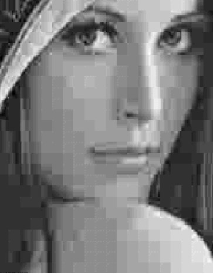
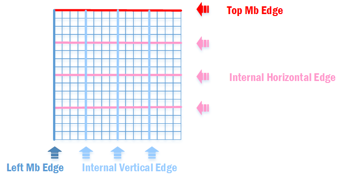
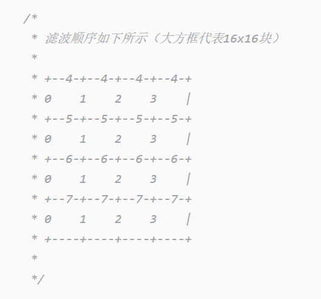
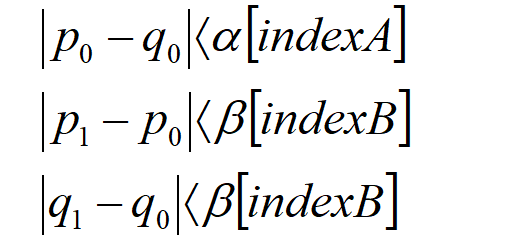
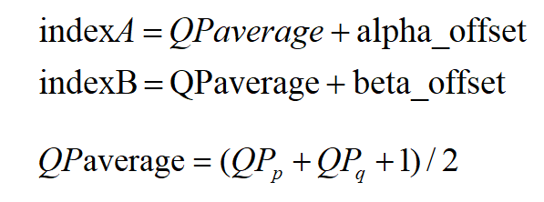
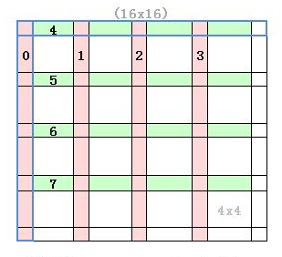

## 块效应产生的原因

#### 什么是块效应？

我们在观看视频的时候，在运动剧烈的场景常能观察到图像出现小方块，小方块在边界处呈现不连续的效果




#### 产生的原因

- 编码过程中对残差数据进行DCT变换，降低图像的部分细节，同时后续的量化会进一步加大图像的损失。因为DCT变换时基于块的，即将8x8或者4x4的像素残差进行变换后得到8x8或者4x4DCT系数，此时如果进行了低码率的量化，就会使得相邻两个块的相关性变差，从而出现块效应。
- h.264的运动补偿加剧了由变换量化导致的块效应。由于运动补偿块的匹配不可能绝对准确，各个块的残差大小程度存在差异，尤其是当相邻两个块所用参考帧不同、运动矢量或参考块的差距过大时，块边界上产生的数据不连续就更加明显。

**块效应主要有两种形式**：一种是由于DCT高频系数被量化为0，使得强边缘在跨边界处出现锯齿状，称为梯形噪声；另一种经常出现在平坦区域，由于量化导致本来平缓变换的亮度块DC系数发生跳跃，造成变换块的基础色调改变，这种称为格形噪声。


## 去块滤波的作用位置

环路滤波器被放置在编码器、解码器的**图像重建环路**当中。无论时编码器还是解码器都是图像被重建后才进行滤波。

在编码器中，滤波后的图像会被作为后续编码图像的参考图像；在解码器中，滤波后的图像进行输出并且作为后续解码图像的参考图像


## 去块滤波的作用 & 效果

去块滤波的作用就是为了**降低图像的块效应**

效果图待补充.....


## 滤波前的准备

#### 1.滤波参数

在**Slice Header**中的语法元素**disable_deblocking_filter_idc**用于控制区块滤波是否打开，有0~2三个取值

> 0：开启滤波，可以跨Slice
>
> 1：关闭滤波
>
> 2：开启滤波，不能跨Slice


#### 2.滤波边界

去块滤波基于宏块进行的，包括16x16的亮度宏块和色度宏块，色度宏块分为几种；

 

图中的粗线为滤波边界，**蓝色为垂直边界，红色为水平边界** 。滤波是以4x4宏块进行的，但如果**transform_8x8_mode_flag**为1时，此时亮度宏块以及4:4:4的色度宏块的滤波边界会把宏块分割成8x8的块


滤波边界还能根据滤波过程是**否会用到当前宏块以外宏块来进行细分**。宏块的顶部边界、左边界由于处于宏块边缘，滤波的时候肯定需要用到相邻宏块，而其余的滤波边界在滤波时只会用到当前宏块内部的像素。




- **Left MB Edge：** 如果当前宏块是整张<u>图像的最左块</u>或者<u>左边宏块是另一个Slice</u>(不允许跨Slice滤波的前提)则不进行滤波
- **Vertical Internal Mb Edge** ： 垂直方向的滤波
- **Top MB Edge**：与Left MB Edge类似
- **Horizontal Internal MB Edge:** 水平方向的滤波


**滤波顺序**：先进行垂直方向的滤波，从左4个宏块往右边。之后进行水平方向的滤波，从上4个宏块往下

*这里贴个雷神的图比较好理解，滤波顺序为下图数字的顺序*




## 滤波过程 & 源码解析

#### 1.估算滤波边界

对于滤波边界，我们首先需要根据边界所在的位置已以及宏块信息来粗略地估计边界两边的像素差距，我们称这个像素差距为边界强度（BS，Boundary Strength）。**BS值越大越容易发生滤波，影响的像素点可能也更多**

| 判断条件                                                     | 边界强度 BS |
| :----------------------------------------------------------- | :---------: |
| P块或者Q块为帧内编码模式，并且块边缘为宏块边缘               |      4      |
| P块或者Q块为帧内编码模式                                     |      3      |
| P块或者Q块的残差变换系数包含非零系数                         |      2      |
| P块或者Q块的残差变换系数都不包含非零系数，并且P块和Q块的参考帧或运动向量不同 |      1      |
| 块或者Q块的残差变换系数都不包含非零系数，并且P块和Q块的参考帧以及运动向量相同 |      0      |

每个4x4宏块都有**两个滤波强度**，一个是针对左方宏块而言，一个是针对上方宏块而言。单个宏块最多会进行**两次**滤波，一次是与左边宏块进行滤波，一次是与上边宏块进行滤波，但并不是一定是两次滤波，有可能只进行一次，也有可能不滤波，**因此单个宏块需要保存两个边界强度(垂直方向和水平方向)** 。   *所以一个16x16的宏块一共拥有2 × 4 × 4 = 32个边界强度，可以用32字节来保存*


x264每编码一个宏块都会**计算当前宏块的边界强度**(前提是开启了去块滤波)，具体的代码位置在encoder.c的slice_write函数调用的x264_macroblock_deblock_strength函数

```c++
/* 计算宏块边界强度，就计算BS而言此函数主要还是调用h->loopf.deblock_strength方法，建议配合上面这个表格阅读下述源码会更容易理解 */
void x264_macroblock_deblock_strength( x264_t *h )
{
    /*
     *  首先我们先分析下这个bs，不然下面的一些赋值操作就不是很好理解
     *  bs是一个数组指针，指向一个[8][4]的二维数组，一共占用32字节，刚好是用来存储当前16x16宏块的边界强度的
     *  我们将其分解两份，其中前面16个字节存储垂直方向的边界强度，后面16个字节存储水平方向的边界强度
     */
    uint8_t (*bs)[8][4] = h->mb.cache.deblock_strength;
    /*
        0  +----+----+----+----+
		   +    +    +    +    |
		1  +----+----+----+----+
		   +    +    +    +    |
		2  +----+----+----+----+
		   +    +    +    +    |
		3  +----+----+----+----+
		   +    +    +    +    |
		   +----+----+----+----+
           0    1    2    3
    */
    if( IS_INTRA( h->mb.i_type ) )
    {
        /* 
         * 如果当前宏块是帧内宏块，16个4x4宏块只有最上边4个宏块的水平方向的和最左边4个的垂直方向的边界强度是4，其他的两个方向上的边界强度都为3
         * 垂直方向上第2、3、4列的宏块的BS置为3，第一列没有设置为4
         * 水平方向上第2、3、4行的宏块的BS置为3，第一行没有设置为4
         * 这里为什么没有将一些宏块的BS设置为4呢？ 这个也不清楚x264的用意，但在真正的滤波的时候如果当前是Intra宏块，会直接对第一行和第一列使用强滤波(BS=4才会使用强滤波的)
         */
        M32( bs[0][1] ) = 0x03030303;  
        M64( bs[0][2] ) = 0x0303030303030303ULL;
        M32( bs[1][1] ) = 0x03030303;
        M64( bs[1][2] ) = 0x0303030303030303ULL;
        return;
    }

    /* Early termination: in this case, nnz guarantees all edges use strength 2.*/
    if( h->mb.b_transform_8x8 && !CHROMA444 )
    {
        int cbp_mask = 0xf >> CHROMA_V_SHIFT;
        if( (h->mb.i_cbp_luma&cbp_mask) == cbp_mask )
        {
            M32( bs[0][0] ) = 0x02020202;
            M32( bs[0][2] ) = 0x02020202;
            M32( bs[0][4] ) = 0x02020202;
            M64( bs[1][0] ) = 0x0202020202020202ULL; /* [1][1] and [1][3] has to be set for 4:2:2 */
            M64( bs[1][2] ) = 0x0202020202020202ULL;
            M32( bs[1][4] ) = 0x02020202;
            return;
        }
    }

    int neighbour_changed = 0;
    if( h->sh.i_disable_deblocking_filter_idc != 2 )
    {
        neighbour_changed = h->mb.i_neighbour_frame&~h->mb.i_neighbour;
        h->mb.i_neighbour = h->mb.i_neighbour_frame;
    }

    /* MBAFF deblock uses different left neighbors from encoding */
    if( SLICE_MBAFF && (h->mb.i_neighbour & MB_LEFT) && (h->mb.field[h->mb.i_mb_xy - 1] != MB_INTERLACED) )
    {
        h->mb.i_mb_left_xy[1] =
        h->mb.i_mb_left_xy[0] = h->mb.i_mb_xy - 1;
        if( h->mb.i_mb_y&1 )
            h->mb.i_mb_left_xy[0] -= h->mb.i_mb_stride;
        else
            h->mb.i_mb_left_xy[1] += h->mb.i_mb_stride;
    }

    /* If we have multiple slices and we're deblocking on slice edges, we
     * have to reload neighbour data. */
    if( neighbour_changed )
    {
        int top_y = h->mb.i_mb_top_y;
        int top_8x8 = (2*top_y+1) * h->mb.i_b8_stride + 2*h->mb.i_mb_x;
        int top_4x4 = (4*top_y+3) * h->mb.i_b4_stride + 4*h->mb.i_mb_x;
        int s8x8 = h->mb.i_b8_stride;
        int s4x4 = h->mb.i_b4_stride;

        uint8_t (*nnz)[48] = h->mb.non_zero_count;
        const x264_left_table_t *left_index_table = SLICE_MBAFF ? h->mb.left_index_table : &left_indices[3];

        if( neighbour_changed & MB_TOP )
            CP32( &h->mb.cache.non_zero_count[x264_scan8[0] - 8], &nnz[h->mb.i_mb_top_xy][12] );

        if( neighbour_changed & MB_LEFT )
        {
            int *left = h->mb.i_mb_left_xy;
            h->mb.cache.non_zero_count[x264_scan8[0 ] - 1] = nnz[left[0]][left_index_table->nnz[0]];
            h->mb.cache.non_zero_count[x264_scan8[2 ] - 1] = nnz[left[0]][left_index_table->nnz[1]];
            h->mb.cache.non_zero_count[x264_scan8[8 ] - 1] = nnz[left[1]][left_index_table->nnz[2]];
            h->mb.cache.non_zero_count[x264_scan8[10] - 1] = nnz[left[1]][left_index_table->nnz[3]];
        }

        for( int l = 0; l <= (h->sh.i_type == SLICE_TYPE_B); l++ )
        {
            int16_t (*mv)[2] = h->mb.mv[l];
            int8_t *ref = h->mb.ref[l];

            int i8 = x264_scan8[0] - 8;
            if( neighbour_changed & MB_TOP )
            {
                h->mb.cache.ref[l][i8+0] =
                h->mb.cache.ref[l][i8+1] = ref[top_8x8 + 0];
                h->mb.cache.ref[l][i8+2] =
                h->mb.cache.ref[l][i8+3] = ref[top_8x8 + 1];
                CP128( h->mb.cache.mv[l][i8], mv[top_4x4] );
            }

            i8 = x264_scan8[0] - 1;
            if( neighbour_changed & MB_LEFT )
            {
                h->mb.cache.ref[l][i8+0*8] =
                h->mb.cache.ref[l][i8+1*8] = ref[h->mb.left_b8[0] + 1 + s8x8*left_index_table->ref[0]];
                h->mb.cache.ref[l][i8+2*8] =
                h->mb.cache.ref[l][i8+3*8] = ref[h->mb.left_b8[1] + 1 + s8x8*left_index_table->ref[2]];

                CP32( h->mb.cache.mv[l][i8+0*8], mv[h->mb.left_b4[0] + 3 + s4x4*left_index_table->mv[0]] );
                CP32( h->mb.cache.mv[l][i8+1*8], mv[h->mb.left_b4[0] + 3 + s4x4*left_index_table->mv[1]] );
                CP32( h->mb.cache.mv[l][i8+2*8], mv[h->mb.left_b4[1] + 3 + s4x4*left_index_table->mv[2]] );
                CP32( h->mb.cache.mv[l][i8+3*8], mv[h->mb.left_b4[1] + 3 + s4x4*left_index_table->mv[3]] );
            }
        }
    }

    if( h->param.analyse.i_weighted_pred == X264_WEIGHTP_SMART && h->sh.i_type == SLICE_TYPE_P )
    {
        /* Handle reference frame duplicates */
        int i8 = x264_scan8[0] - 8;
        h->mb.cache.ref[0][i8+0] =
        h->mb.cache.ref[0][i8+1] = deblock_ref_table(h->mb.cache.ref[0][i8+0]);
        h->mb.cache.ref[0][i8+2] =
        h->mb.cache.ref[0][i8+3] = deblock_ref_table(h->mb.cache.ref[0][i8+2]);

        i8 = x264_scan8[0] - 1;
        h->mb.cache.ref[0][i8+0*8] =
        h->mb.cache.ref[0][i8+1*8] = deblock_ref_table(h->mb.cache.ref[0][i8+0*8]);
        h->mb.cache.ref[0][i8+2*8] =
        h->mb.cache.ref[0][i8+3*8] = deblock_ref_table(h->mb.cache.ref[0][i8+2*8]);

        int ref0 = deblock_ref_table(h->mb.cache.ref[0][x264_scan8[ 0]]);
        int ref1 = deblock_ref_table(h->mb.cache.ref[0][x264_scan8[ 4]]);
        int ref2 = deblock_ref_table(h->mb.cache.ref[0][x264_scan8[ 8]]);
        int ref3 = deblock_ref_table(h->mb.cache.ref[0][x264_scan8[12]]);
        uint32_t reftop = pack16to32( (uint8_t)ref0, (uint8_t)ref1 ) * 0x0101;
        uint32_t refbot = pack16to32( (uint8_t)ref2, (uint8_t)ref3 ) * 0x0101;

        M32( &h->mb.cache.ref[0][x264_scan8[0]+8*0] ) = reftop;
        M32( &h->mb.cache.ref[0][x264_scan8[0]+8*1] ) = reftop;
        M32( &h->mb.cache.ref[0][x264_scan8[0]+8*2] ) = refbot;
        M32( &h->mb.cache.ref[0][x264_scan8[0]+8*3] ) = refbot;
    }

    /* Munge NNZ for cavlc + 8x8dct */
    /* 对于开启transform8x8且使用CAVLC时会对“非零系数”做特殊处理 */
    if( !h->param.b_cabac && h->pps->b_transform_8x8_mode )
    {
        uint8_t (*nnz)[48] = h->mb.non_zero_count;
        int top = h->mb.i_mb_top_xy;
        int *left = h->mb.i_mb_left_xy;

        if( (h->mb.i_neighbour & MB_TOP) && h->mb.mb_transform_size[top] )
        {
            int i8 = x264_scan8[0] - 8;
            int nnz_top0 = M16( &nnz[top][8] ) | M16( &nnz[top][12] );
            int nnz_top1 = M16( &nnz[top][10] ) | M16( &nnz[top][14] );
            M16( &h->mb.cache.non_zero_count[i8+0] ) = nnz_top0 ? 0x0101 : 0;
            M16( &h->mb.cache.non_zero_count[i8+2] ) = nnz_top1 ? 0x0101 : 0;
        }

        if( h->mb.i_neighbour & MB_LEFT )
        {
            int i8 = x264_scan8[0] - 1;
            if( h->mb.mb_transform_size[left[0]] )
            {
                int nnz_left0 = M16( &nnz[left[0]][2] ) | M16( &nnz[left[0]][6] );
                h->mb.cache.non_zero_count[i8+8*0] = !!nnz_left0;
                h->mb.cache.non_zero_count[i8+8*1] = !!nnz_left0;
            }
            if( h->mb.mb_transform_size[left[1]] )
            {
                int nnz_left1 = M16( &nnz[left[1]][10] ) | M16( &nnz[left[1]][14] );
                h->mb.cache.non_zero_count[i8+8*2] = !!nnz_left1;
                h->mb.cache.non_zero_count[i8+8*3] = !!nnz_left1;
            }
        }

        if( h->mb.b_transform_8x8 )
        {
            int nnz0 = M16( &h->mb.cache.non_zero_count[x264_scan8[ 0]] ) | M16( &h->mb.cache.non_zero_count[x264_scan8[ 2]] );
            int nnz1 = M16( &h->mb.cache.non_zero_count[x264_scan8[ 4]] ) | M16( &h->mb.cache.non_zero_count[x264_scan8[ 6]] );
            int nnz2 = M16( &h->mb.cache.non_zero_count[x264_scan8[ 8]] ) | M16( &h->mb.cache.non_zero_count[x264_scan8[10]] );
            int nnz3 = M16( &h->mb.cache.non_zero_count[x264_scan8[12]] ) | M16( &h->mb.cache.non_zero_count[x264_scan8[14]] );
            uint32_t nnztop = pack16to32( !!nnz0, !!nnz1 ) * 0x0101;
            uint32_t nnzbot = pack16to32( !!nnz2, !!nnz3 ) * 0x0101;

            M32( &h->mb.cache.non_zero_count[x264_scan8[0]+8*0] ) = nnztop;
            M32( &h->mb.cache.non_zero_count[x264_scan8[0]+8*1] ) = nnztop;
            M32( &h->mb.cache.non_zero_count[x264_scan8[0]+8*2] ) = nnzbot;
            M32( &h->mb.cache.non_zero_count[x264_scan8[0]+8*3] ) = nnzbot;
        }
    }
    // 计算边界强度
    h->loopf.deblock_strength( h->mb.cache.non_zero_count, h->mb.cache.ref, h->mb.cache.mv,
                               bs, 4 >> MB_INTERLACED, h->sh.i_type == SLICE_TYPE_B );

    if( SLICE_MBAFF )
        macroblock_deblock_strength_mbaff( h, bs );
}
```


```c++
// deblock_strength函数存在C语言实现版本和多个汇编实现的版本，为了方便了解原理直接看C语言的实现版本即可
// 此函数在common/deblock.c
static void deblock_strength_c( uint8_t nnz[X264_SCAN8_SIZE], int8_t ref[2][X264_SCAN8_LUMA_SIZE],
                                int16_t mv[2][X264_SCAN8_LUMA_SIZE][2], uint8_t bs[2][8][4], int mvy_limit,
                                int bframe )
{
    // 两个方向，先垂直后水平, 注意代码执行到这里就说明当前宏块已经是帧间宏块了，如果是帧内宏块在x264_macroblock_deblock_strength计算完就return了
    for( int dir = 0; dir < 2; dir++ )
    {
        int s1 = dir ? 1 : 8;
        int s2 = dir ? 8 : 1;
        for( int edge = 0; edge < 4; edge++ )  // 4个边界
            for( int i = 0, loc = X264_SCAN8_0+edge*s2; i < 4; i++, loc += s1 )
            {
                int locn = loc - s2; // 相邻宏块的位置
                if( nnz[loc] || nnz[locn] ) // 如果当前宏块和相邻宏块有一个残差变换系数包含非零系数设置BS为2(参考上述表格)
                    bs[dir][edge][i] = 2;
                else if( ref[0][loc] != ref[0][locn] ||
                         abs( mv[0][loc][0] - mv[0][locn][0] ) >= 4 ||
                         abs( mv[0][loc][1] - mv[0][locn][1] ) >= mvy_limit ||
                        (bframe && (ref[1][loc] != ref[1][locn] ||
                         abs( mv[1][loc][0] - mv[1][locn][0] ) >= 4 ||
                         abs( mv[1][loc][1] - mv[1][locn][1] ) >= mvy_limit )))
                {
                    bs[dir][edge][i] = 1;  // 如果参考帧相同或者MV不同则设置BS为1
                }
                else
                    bs[dir][edge][i] = 0; // 否则设置为0
            }
    }
}
```


#### 2.区分真假边界

在粗略地估算滤波边界强度后，我们需要区分这个边界强度是由于对块进行DCT变换量化引起的块效应（**虚假边界**）还是视频图像原有的边界（**真实边界**），对于真实边界不需要进行滤波，虚假边界需要进行滤波

> 1.真实边界两边的像素的差值通常比虚假边界的要大
>
> 2.对于两边像素值差别不是很大的真实边界，即使进行了滤波主观上也不会有太大影响

因此 滤波遵循以下准则：

- 在**平坦区域**，即使很小的像素不连续也很容易被人察觉，所以要使用**比较强的去块滤波，可以改变较多的像素点**
- 对于**复杂的区域**，为了保持图像细节，要使用**较弱的去块滤波，改变较少的像素点**


标准H264中设定了**两个阈值α和β来判断真假边界**，<u>α表示块与块之间的边界阈值，β表示块内部边界的阈值</u>。对于边界两边的像素点的差值，**如果下面三个条件都满足就会被判定为需要滤波的虚假边界，否则就判定为不需要滤波真实边界**。





公式中的α、β是一个常量数组




alpha_offset和bate_offset为Slice Header中携带的字段**slice_alpha_c0_offset_div2、slice_beta_offset_div2左移一位**得到

QPaverage是当前宏块和相邻宏块的平均QP


由上述公式可知，**α[index]和β[index]取决与QP和偏移值**， α和β的表格对应如下：

| Index | 0    | 1    | 2    | 3    | 4    | 5    | 6    | 7    | 8    | 9    | 10   | 11   | 12   | 13   | 14   | 15   | 16   | 17   |
| ----- | ---- | ---- | ---- | ---- | ---- | ---- | ---- | ---- | ---- | ---- | ---- | ---- | ---- | ---- | ---- | ---- | ---- | ---- |
| α     | 0    | 0    | 0    | 0    | 0    | 0    | 0    | 0    | 0    | 0    | 0    | 0    | 0    | 0    | 0    | 0    | 4    | 4    |
| β     | 0    | 0    | 0    | 0    | 0    | 0    | 0    | 0    | 0    | 0    | 0    | 0    | 0    | 0    | 0    | 0    | 2    | 2    |

| Index | 18   | 19   | 20   | 21   | 22   | 23   | 24   | 25   | 26   | 27   | 28   | 29   | 30   | 31   | 32   | 33   | 34   | 35   |
| ----- | ---- | ---- | ---- | ---- | ---- | ---- | ---- | ---- | ---- | ---- | ---- | ---- | ---- | ---- | ---- | ---- | ---- | ---- |
| α     | 5    | 6    | 7    | 8    | 9    | 10   | 12   | 13   | 15   | 17   | 20   | 22   | 25   | 28   | 32   | 36   | 40   | 45   |
| β     | 2    | 3    | 3    | 3    | 3    | 4    | 4    | 4    | 6    | 6    | 7    | 7    | 8    | 8    | 9    | 9    | 10   | 10   |

| Index | 36   | 37   | 38   | 39   | 40   | 41   | 42   | 43   | 44   | 45   | 46   | 47   | 48   | 49   | 50   | 51   |
| ----- | ---- | ---- | ---- | ---- | ---- | ---- | ---- | ---- | ---- | ---- | ---- | ---- | ---- | ---- | ---- | ---- |
| α     | 50   | 56   | 63   | 71   | 80   | 90   | 101  | 113  | 127  | 144  | 162  | 182  | 203  | 226  | 255  | 255  |
| β     | 11   | 11   | 12   | 12   | 13   | 13   | 14   | 14   | 15   | 15   | 16   | 16   | 17   | 17   | 18   | 18   |

<u>可见QP越大（Index越大），α[indexA]与β[indexB]就越大。QP越大意味着量化误差越大，块效应会越明显，因此阈值也应该取较大值来增大滤波效果，反之阈值应该取较小值</u>


#### 3.滤波运算

5种边界强度，当**边界强度为0时不需要滤波**

H264有两种滤波器：

- BS = 1,2,3 采用强度较弱的滤波器，**首先改变p0、q0两个像素点，接着用阈值β判断是否需要调整p1和q1**
- BS = 4，使用强滤波，此滤波包含两种强度的滤波器，**强滤波器可以改变6个像素点（p0、p1、p2、q0、q1、q2）**，弱滤波器只改变边界上的两个点（p0、q0）

<u>**色度分量最多滤波p0、q0两个像素点**</u>

> **BS = 1,2,3时的弱滤波运算**


**p0、q0的滤波** （下面1.2.3几个过程配合代码进行阅读）

1. 先要得到差值Δ，差值的计算方式：Δ = ( (q0-p0)<<2 + (p1-q1) + 4 ) >> 3

2. 然后需要对差值Δ进行限幅，保证这个差值在一定的范围内，这个范围主要通过查表得到，详情请查看标准8.7.2.3

3. 用差值Δ来计算新的p0、q0，也就是滤波后的值

   

如果满足**|p2-p0|<β**则进行**p1的滤波**(q1也是如此)

1. 先要得到差值Δ，差值的计算方式为：Δ = ( p2 + ((p0+q0+1)>>1) − (p1<<1)) >> 1
2. 然后需要对差值Δ进行限幅，保证这个差值在一定范围内，这个范围主要通过查表得到，详情请查看标准8.7.2.3
3. 用差值来计算新的p1


> **BS = 4时的强滤波运算**

在h.264的帧内预测编码中，倾向于对纹理简单的区域用16x16亮度预测模式编码（如蓝天、白色墙面等），以达到快速编码的目的。虽然这种方法只会在宏块边界引起轻微的块效应，但是在这种情况下，即使很小的强度值查表也会在视觉上产生陡峭的阶梯状的感觉（色块分层），因而对于这种**内容平滑的宏块边界就需要采用较强的滤波器**；如果此时**宏块边界有大量的细节存在，反而不应做强滤波**。对此h.264仍采用阈值法来判断是否存在真实边界，如果不存在大量细节信息，可以做**强滤波**，反之做**弱滤波**。

✔**|p0 − q0| < (α>>2) + 2**

✔**|p2 - p0| < β** 或 **|q2 - q0| < β**

**如果满足上述两个条件则进行强滤波，否则使用弱滤波**

*下述是对p进行滤波的公式，q的公式类似*

> 强滤波公式


> 弱滤波公式


以**Intra16x16宏块**为例，去块滤波的顺序如下：



**其中0和4使用强滤波，其他的使用弱滤波**

```c++

void x264_frame_deblock_row( x264_t *h, int mb_y )
{
    int b_interlaced = SLICE_MBAFF;
    int a = h->sh.i_alpha_c0_offset - QP_BD_OFFSET;
    int b = h->sh.i_beta_offset - QP_BD_OFFSET;
    int qp_thresh = 15 - X264_MIN( a, b ) - X264_MAX( 0, h->pps->i_chroma_qp_index_offset );
    int stridey   = h->fdec->i_stride[0];
    int strideuv  = h->fdec->i_stride[1];
    int chroma_format = CHROMA_FORMAT;
    int chroma444 = CHROMA444;
    int chroma_height = 16 >> CHROMA_V_SHIFT;
    intptr_t uvdiff = chroma444 ? h->fdec->plane[2] - h->fdec->plane[1] : 1;
    
    // 遍历一整行的宏块
    for( int mb_x = 0; mb_x < h->mb.i_mb_width; mb_x += (~b_interlaced | mb_y)&1, mb_y ^= b_interlaced )
    {
        x264_prefetch_fenc( h, h->fdec, mb_x, mb_y );
        macroblock_cache_load_neighbours_deblock( h, mb_x, mb_y );

        int mb_xy = h->mb.i_mb_xy;
        int transform_8x8 = h->mb.mb_transform_size[mb_xy];  // 当前宏块是否是8x8DCT
        int intra_cur = IS_INTRA( h->mb.type[mb_xy] );
        uint8_t (*bs)[8][4] = h->deblock_strength[mb_y&1][h->param.b_sliced_threads?mb_xy:mb_x];
        // 找到对应的像素
        pixel *pixy = h->fdec->plane[0] + 16*mb_y*stridey  + 16*mb_x;
        pixel *pixuv = h->fdec->plane[1] + chroma_height*mb_y*strideuv + 16*mb_x;

        if( mb_y & MB_INTERLACED )
        {
            pixy -= 15*stridey;
            pixuv -= (chroma_height-1)*strideuv;
        }

        int stride2y  = stridey << MB_INTERLACED;
        int stride2uv = strideuv << MB_INTERLACED;
        int qp = h->mb.qp[mb_xy];   // 当前宏块的亮度QP
        int qpc = h->chroma_qp_table[qp]; // 当前宏块的色度QP
        int first_edge_only = (h->mb.partition[mb_xy] == D_16x16 && !h->mb.cbp[mb_xy] && !intra_cur) || qp <= qp_thresh;
        
        /*
           去块滤波的宏定义
           宏定义中包含个参数
           intra: 如果传进来是“_intra”说明是强滤波(BS = 4)，否则是弱滤波（BS < 4）
           dir: 滤波的方向，0表示垂直方向，1表示水平方向
           edge：为滤波边界的index（范围为0~3）
           qp： 亮度QP
           chrma_qp: 色度QP
           
           宏定义中的##是连接符，如果intra传入的是“intra_”则调用的函数时deblock_edge_intra(...., h->loopf.deblock_luma_intra[dir]);
           否则调用的时deblock_edge(....,h->loopf.deblock_luma[dir]);
           deblock_edge##intra函数中会对设置一下相关参数，真正进行滤波的函数是h->loopf.deblock_luma##intra[dir]
           
           宏FILTER中实际会调用两次deblock_edge##intra，一次是亮度块的滤波，一次是色度块的滤波
           
           疑问：if( !(edge & 1) || !transform_8x8 )为什么会有这个条件判断呢？
           答：滤波的尺寸可以是4x4也可以是8x8，如果是8x8的话调用deblock_edge函数的次数应该比4x4的少一半，所以通过上述的if(xxx)控制，
           如果transform_8x8为false，说明不是8x8能直接进入if中的代码，如果transform_8x8为true则通过edge限制，只有edge=0、2的时候才进入if中的代码，1、3则不进入
        */
        #define FILTER( intra, dir, edge, qp, chroma_qp )\
        do\
        {\
            if( !(edge & 1) || !transform_8x8 )\
            {\
                deblock_edge##intra( h, pixy + 4*edge*(dir?stride2y:1),\
                                     stride2y, bs[dir][edge], qp, a, b, 0,\
                                     h->loopf.deblock_luma##intra[dir] );\
                if( chroma_format == CHROMA_444 )\
                {\
                    deblock_edge##intra( h, pixuv          + 4*edge*(dir?stride2uv:1),\
                                         stride2uv, bs[dir][edge], chroma_qp, a, b, 0,\
                                         h->loopf.deblock_luma##intra[dir] );\
                    deblock_edge##intra( h, pixuv + uvdiff + 4*edge*(dir?stride2uv:1),\
                                         stride2uv, bs[dir][edge], chroma_qp, a, b, 0,\
                                         h->loopf.deblock_luma##intra[dir] );\
                }\
                else if( chroma_format == CHROMA_420 && !(edge & 1) )\
                {\
                    deblock_edge##intra( h, pixuv + edge*(dir?2*stride2uv:4),\
                                         stride2uv, bs[dir][edge], chroma_qp, a, b, 1,\
                                         h->loopf.deblock_chroma##intra[dir] );\
                }\
            }\
            if( chroma_format == CHROMA_422 && (dir || !(edge & 1)) )\
            {\
                deblock_edge##intra( h, pixuv + edge*(dir?4*stride2uv:4),\
                                     stride2uv, bs[dir][edge], chroma_qp, a, b, 1,\
                                     h->loopf.deblock_chroma##intra[dir] );\
            }\
        } while( 0 )

        if( h->mb.i_neighbour & MB_LEFT )  // 检测左边宏块是否有效(先进行垂直方向的滤波，所以先检测左边宏块的有效性)
        {
            if( b_interlaced && h->mb.field[h->mb.i_mb_left_xy[0]] != MB_INTERLACED )
            {
                // .... 隔行扫描的去块滤波，隔行的方式目前使用比较少，这里就不贴上代码了
            }
            else
            {
                int qpl = h->mb.qp[h->mb.i_mb_xy-1];  // 左边宏块的亮度QP
                int qp_left = (qp + qpl + 1) >> 1;  // 计算亮度QPaverage
                int qpc_left = (qpc + h->chroma_qp_table[qpl] + 1) >> 1;  // 计算色度QPaverage
                int intra_left = IS_INTRA( h->mb.type[h->mb.i_mb_xy-1] ); // 左边宏块是否是帧内宏块
                int intra_deblock = intra_cur || intra_left;  // 当前宏块和左边宏块是否存在是帧内宏块的

                /* Any MB that was coded, or that analysis decided to skip, has quality commensurate with its QP.
                 * But if deblocking affects neighboring MBs that were force-skipped, blur might accumulate there.
                 * So reset their effective QP to max, to indicate that lack of guarantee. */
                if( h->fdec->mb_info && M32( bs[0][0] ) )
                {
#define RESET_EFFECTIVE_QP(xy) h->fdec->effective_qp[xy] |= 0xff * !!(h->fdec->mb_info[xy] & X264_MBINFO_CONSTANT);
                    RESET_EFFECTIVE_QP(mb_xy);
                    RESET_EFFECTIVE_QP(h->mb.i_mb_left_xy[0]);
                }
				/* 
					下面的edge为0，说明是16x16宏块中的第一列4x4宏块，如果此时intra_deblock为true，刚好符合BS=4的条件
				   	此时调用FILTER( _intra, 0, 0, qp_left, qpc_left ); 执行强滤波
				   	否则调用FILTER(       , 0, 0, qp_left, qpc_left ); 执行弱滤波
				*/
                if( intra_deblock ) 
                    FILTER( _intra, 0, 0, qp_left, qpc_left );  // 强滤波,BS = 4
                else
                    FILTER(       , 0, 0, qp_left, qpc_left );  // 弱滤波，BS < 4
            }
        }
        if( !first_edge_only )
        {
            FILTER( , 0, 1, qp, qpc ); // 第2列4x4宏块执行弱滤波
            FILTER( , 0, 2, qp, qpc ); // 第3列4x4宏块执行弱滤波
            FILTER( , 0, 3, qp, qpc ); // 第4列4x4宏块执行弱滤波
        }

        if( h->mb.i_neighbour & MB_TOP )  // 检测上边宏块是否有效(后进行水平方向的滤波，所以检测上边宏块的有效性)
        {
            if( b_interlaced && !(mb_y&1) && !MB_INTERLACED && h->mb.field[h->mb.i_mb_top_xy] )
            {
                // .... 隔行扫描的去块滤波，隔行的方式目前使用比较少，这里就不贴上代码了
            }
            else
            {
                int qpt = h->mb.qp[h->mb.i_mb_top_xy]; // 上方宏块的亮度QP
                int qp_top = (qp + qpt + 1) >> 1; // QPaverage
                int qpc_top = (qpc + h->chroma_qp_table[qpt] + 1) >> 1;  // 上边宏块的色度QP
                int intra_top = IS_INTRA( h->mb.type[h->mb.i_mb_top_xy] );
                int intra_deblock = intra_cur || intra_top;

                /* This edge has been modified, reset effective qp to max. */
                if( h->fdec->mb_info && M32( bs[1][0] ) )
                {
                    RESET_EFFECTIVE_QP(mb_xy);
                    RESET_EFFECTIVE_QP(h->mb.i_mb_top_xy);
                }

                // 与垂直方向滤波的类似
                if( (!b_interlaced || (!MB_INTERLACED && !h->mb.field[h->mb.i_mb_top_xy])) && intra_deblock )
                {
                    FILTER( _intra, 1, 0, qp_top, qpc_top ); // 第1行4x4宏块强滤波
                }
                else
                {
                    if( intra_deblock )
                        M32( bs[1][0] ) = 0x03030303;
                    FILTER(       , 1, 0, qp_top, qpc_top ); // 第1行4x4宏块弱滤波
                }
            }
        }

        if( !first_edge_only )
        {
            FILTER( , 1, 1, qp, qpc ); // 第2行4x4宏块弱滤波
            FILTER( , 1, 2, qp, qpc ); // 第3行4x4宏块弱滤波
            FILTER( , 1, 3, qp, qpc ); // 第4行4x4宏块弱滤波
        }

        #undef FILTER
    }
}
```


deblock_edge##intra函数分为两种，**deblock_edge**和**deblock_edge_intra**

**//  deblock_edge（弱滤波）**

```c++
/* 函数位置common/deblock.c */
static ALWAYS_INLINE void deblock_edge( x264_t *h, pixel *pix, intptr_t i_stride, uint8_t bS[4], int i_qp,
                                        int a, int b, int b_chroma, x264_deblock_inter_t pf_inter )
{
    int index_a = i_qp + a;  // 根据QPaverage和alpha_offset、beta_offset得到对应的indexA、indexB
    int index_b = i_qp + b;
    int alpha = alpha_table(index_a) << (BIT_DEPTH-8); // 根据indexA、indexB查表获得对应的alpha、beta值（见上述公式和表格）
    int beta  = beta_table(index_b) << (BIT_DEPTH-8);
    int8_t tc[4];

    if( !M32(bS) || !alpha || !beta )  // 如果alpha和beta存在0，直接return，因为上述的“区分真假边界”的条件一定满足不了
        return;

    /*
    	bs中存储着当前4个4x4宏块的边界强度，通过tc0_table(index_a)[]的形式，转换成某个值存储到tc[]中
    	这里我们暂时不需要关心它为什么需要这一步转换，先明确一下结果：
    	对于亮度块：如果bs[i]为0，则得到的tc[i]也为0，如果bs[i]>0得到的tc[i]也大于0
    	对于色度块：如果bs[i]为0，得到的tc[i]为1(因为+b_chroma的缘故)， 如果bs[i]>0则tc[i]>1
    */
    tc[0] = (tc0_table(index_a)[bS[0]] << (BIT_DEPTH-8)) + b_chroma;
    tc[1] = (tc0_table(index_a)[bS[1]] << (BIT_DEPTH-8)) + b_chroma;
    tc[2] = (tc0_table(index_a)[bS[2]] << (BIT_DEPTH-8)) + b_chroma;
    tc[3] = (tc0_table(index_a)[bS[3]] << (BIT_DEPTH-8)) + b_chroma;
	// 调用实际的弱滤波函数
    pf_inter( pix, i_stride, alpha, beta, tc );
}
```


**// deblock_edge_intra（强滤波）**

```c++
/* 函数位置common/deblock.c */
static ALWAYS_INLINE void deblock_edge_intra( x264_t *h, pixel *pix, intptr_t i_stride, uint8_t bS[4], int i_qp,
                                              int a, int b, int b_chroma, x264_deblock_intra_t pf_intra )
{
    int index_a = i_qp + a; // 根据QPaverage和alpha_offset、beta_offset得到对应的indexA、indexB
    int index_b = i_qp + b;
    int alpha = alpha_table(index_a) << (BIT_DEPTH-8); // 根据indexA、indexB查表获得对应的alpha、beta值（见上述公式和表格）
    int beta  = beta_table(index_b) << (BIT_DEPTH-8);

    if( !alpha || !beta ) // 如果alpha和beta存在0，直接return，因为上述的“区分真假边界”的条件一定满足不了
        return;
	// 调用实际的强滤波函数
    pf_intra( pix, i_stride, alpha, beta );
}
```


由deblock_edge##intra的代码可以看出，真正进行滤波的函数是h->loopf.deblock_luma##intra[dir]和h->loopf.deblock_chroma##intra[dir] （分别进行亮度和色度块的滤波）deblock_luma##intra是一个x264_deblock_inter_t类型的函数指针

```c++
// 滤波的函数指针
x264_deblock_inter_t deblock_luma[2];  // 亮度块的弱滤波函数指针, deblock_luma[0]为垂直方向，deblock_luma[1]为水平方向
x264_deblock_inter_t deblock_chroma[2]; // 色度块的弱滤波函数指针
x264_deblock_intra_t deblock_luma_intra[2]; // 亮度块的强滤波函数指针
x264_deblock_intra_t deblock_chroma_intra[2]; // 色度块的强滤波函数指针

// 滤波函数指针初始化
pf->deblock_luma[1] = deblock_v_luma_c;
pf->deblock_luma[0] = deblock_h_luma_c;
pf->deblock_chroma[1] = deblock_v_chroma_c;
pf->deblock_luma_intra[1] = deblock_v_luma_intra_c;
pf->deblock_luma_intra[0] = deblock_h_luma_intra_c;
pf->deblock_chroma_intra[1] = deblock_v_chroma_intra_c;
```

*垂直和水平方向的滤波类似，亮度块与色度块的滤波过程也类似，这里就介绍垂直方向的亮度块强滤波和弱滤波*

**亮度块垂直方向BS=1、2、3的弱滤波**

```c++
static void deblock_h_luma_c( pixel *pix, intptr_t stride, int alpha, int beta, int8_t *tc0 )
{
    deblock_luma_c( pix, 1, stride, alpha, beta, tc0 );
}


static inline void deblock_luma_c( pixel *pix, intptr_t xstride, intptr_t ystride, int alpha, int beta, int8_t *tc0 )
{
    // 一次滤波是一列或者一行，即4个4x4宏块，这里遍历4个宏块
    for( int i = 0; i < 4; i++ )
    {
        if( tc0[i] < 0 ) 
        {
            // 由上面分析可以知道对于BS[i] < 0的对应的tc[i] < 0，这里continue，因为BS=0是不需要滤波的
            pix += 4*ystride;
            continue;
        }
        // 遍历4x4宏块边的四个像素点
        for( int d = 0; d < 4; d++, pix += ystride )
            deblock_edge_luma_c( pix, xstride, alpha, beta, tc0[i] );
    }
}

static ALWAYS_INLINE void deblock_edge_luma_c( pixel *pix, intptr_t xstride, int alpha, int beta, int8_t tc0 )
{
    /*
         相邻宏块像素       当前宏块像素
       [][p2][p1][p0] | [q0][q1][q2][]
    */
    // 先获取当前宏块和相邻宏块的几个像素点的值
    int p2 = pix[-3*xstride];
    int p1 = pix[-2*xstride];
    int p0 = pix[-1*xstride];
    int q0 = pix[ 0*xstride];
    int q1 = pix[ 1*xstride];
    int q2 = pix[ 2*xstride];

    // 如果满足“区分真假边界”的三个条件则进行滤波
    if( abs( p0 - q0 ) < alpha && abs( p1 - p0 ) < beta && abs( q1 - q0 ) < beta )
    {
        int tc = tc0;
        int delta;
        // 如果|p2-p0|<β，则对p1像素点进行滤波
        if( abs( p2 - p0 ) < beta )
        {
            if( tc0 )
                pix[-2*xstride] = p1 + x264_clip3( (( p2 + ((p0 + q0 + 1) >> 1)) >> 1) - p1, -tc0, tc0 );
            tc++;
        }
        // 如果|q2-q0|<β，则对q1像素点进行滤波
        if( abs( q2 - q0 ) < beta )
        {
            if( tc0 )
                pix[ 1*xstride] = q1 + x264_clip3( (( q2 + ((p0 + q0 + 1) >> 1)) >> 1) - q1, -tc0, tc0 );
            tc++;
        }
		// 计算Δ = ( (q0-p0)<<2 + (p1-q1) + 4 ) >> 3， 并对Δ 进行限幅在[-tc,tc]之间
        delta = x264_clip3( (((q0 - p0 ) << 2) + (p1 - q1) + 4) >> 3, -tc, tc );
        pix[-1*xstride] = x264_clip_pixel( p0 + delta );    // 对p0像素进行滤波
        pix[ 0*xstride] = x264_clip_pixel( q0 - delta );    // 对q0像素进行滤波
    }
}
```


**亮度块垂直方向BS=4的强滤波**

```c++
static void deblock_h_luma_intra_c( pixel *pix, intptr_t stride, int alpha, int beta )
{
    deblock_luma_intra_c( pix, 1, stride, alpha, beta );
}

static inline void deblock_luma_intra_c( pixel *pix, intptr_t xstride, intptr_t ystride, int alpha, int beta )
{
    for( int d = 0; d < 16; d++, pix += ystride )
        deblock_edge_luma_intra_c( pix, xstride, alpha, beta );
}


static ALWAYS_INLINE void deblock_edge_luma_intra_c( pixel *pix, intptr_t xstride, int alpha, int beta )
{
    /*
         相邻宏块像素       当前宏块像素
       [][p2][p1][p0] | [q0][q1][q2][]
    */
    // 先获取当前宏块和相邻宏块的几个像素点的值
    int p2 = pix[-3*xstride];
    int p1 = pix[-2*xstride];
    int p0 = pix[-1*xstride];
    int q0 = pix[ 0*xstride];
    int q1 = pix[ 1*xstride];
    int q2 = pix[ 2*xstride];

    // 如果满足“区分真假边界”的三个条件则进行滤波
    if( abs( p0 - q0 ) < alpha && abs( p1 - p0 ) < beta && abs( q1 - q0 ) < beta )
    {
        if( abs( p0 - q0 ) < ((alpha >> 2) + 2) )
        {
            if( abs( p2 - p0 ) < beta ) /* p0', p1', p2' */
            {
                // 满足BS=4强滤波的两个条件： (|p0 − q0| < (α>>2) + 2) && (|p2 - p0| < β)进行强滤波 
                const int p3 = pix[-4*xstride];
                pix[-1*xstride] = ( p2 + 2*p1 + 2*p0 + 2*q0 + q1 + 4 ) >> 3;
                pix[-2*xstride] = ( p2 + p1 + p0 + q0 + 2 ) >> 2;
                pix[-3*xstride] = ( 2*p3 + 3*p2 + p1 + p0 + q0 + 4 ) >> 3;
            }
            else /* p0' 不满足(|p2 - p0| < β)进行弱滤波 */
                pix[-1*xstride] = ( 2*p1 + p0 + q1 + 2 ) >> 2;
            if( abs( q2 - q0 ) < beta ) /* q0', q1', q2' */
            {
                // 满足BS=4强滤波的两个条件： (|p0 − q0| < (α>>2) + 2) && (|q2 - q0| < β)进行强滤波 
                const int q3 = pix[3*xstride];
                pix[0*xstride] = ( p1 + 2*p0 + 2*q0 + 2*q1 + q2 + 4 ) >> 3;
                pix[1*xstride] = ( p0 + q0 + q1 + q2 + 2 ) >> 2;
                pix[2*xstride] = ( 2*q3 + 3*q2 + q1 + q0 + p0 + 4 ) >> 3;
            }
            else /* q0' 不满足(|q2 - q0| < β)进行弱滤波*/
                pix[0*xstride] = ( 2*q1 + q0 + p1 + 2 ) >> 2;
        }
        else /* p0', q0' */
        {
            // 不满足(|p0 − q0| < (α>>2) + 2)条件进行弱滤波
            pix[-1*xstride] = ( 2*p1 + p0 + q1 + 2 ) >> 2;
            pix[ 0*xstride] = ( 2*q1 + q0 + p1 + 2 ) >> 2;
        }
    }
}
    
```


## 总结

去块滤波模块是为了降低由于DCT量化和运动搜索造成的像素块效应，每个宏块都存在两个方向的BS(边界强度)，BS范围为[0,4]，BS=0不进行滤波，BS=1,2,3采弱滤波，BS=4使用强滤波。在真正滤波前需要进行"区分真假边界"，只有满足相应条件才进行真正的滤波。弱滤波最多影响4个像素点，强滤波最多影响6个像素点。


### 参考引用

🐱‍🏍https://github.com/mirror/x264

🐱‍🏍https://blog.csdn.net/leixiaohua1020/article/details/45870269?spm=1001.2014.3001.5501

🐱‍🏍https://www.cnblogs.com/TaigaCon/p/5500110.html

